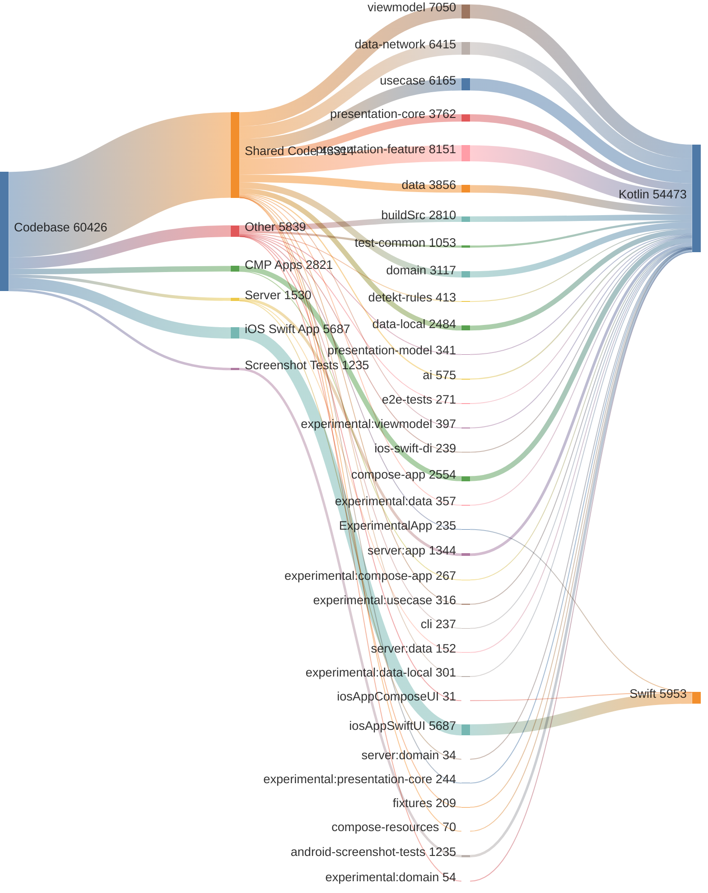

# Battery Butler

[](https://github.com/cartland/battery-butler/actions/workflows/ci.yml?query=branch%3Amain)
[](https://github.com/cartland/battery-butler/actions/workflows/release-android.yml)
<!-- Server badge (uncomment when AWS infra is re-enabled):
[](https://github.com/cartland/battery-butler/actions/workflows/server-build.yml?query=branch%3Amain)
-->
> **Server**: AWS infrastructure is hibernated. Server workflows are disabled. See [`server/README.md`](server/README.md) for the re-enable checklist.

**Battery Butler** is a Kotlin Multiplatform (KMP) application designed to help users track battery usage and replacements for their household devices. It leverages modern Android and KMP technologies including Compose Multiplatform, Room, and on-device AI integration.

## 🚀 Features

*   **Device Management**: Add, edit, and delete devices with custom attributes (name, location).
*   **Battery History**: Track battery replacement events for each device.
*   **Device Types**: Manage reusable device types (e.g., "TV Remote" uses 2x AAA batteries).
*   **AI Integration**:
    *   **Magic AI Button**: Automatically suggests device types and icons based on descriptions.
    *   **Batch Import**: Parse natural language notes (e.g., "Replaced smoke detector battery yesterday") to batch create events.
*   **Cross-Platform**: Runs on Android, iOS, and Desktop (JVM).

## 🏗 Architecture

The project follows **Clean Architecture** principles adapted for Kotlin Multiplatform.

For a detailed deep-dive into the module structure, dependency graph, and strict layer rules, please read the **[Architecture Documentation](docs/Architecture.md)**.

### Module Structure

```mermaid
%% GENERATED FILE - DO NOT EDIT
graph TD
    subgraph "iOS Apps"
        IosSwiftDi[":ios-swift-di"]
        IosAppComposeUi.xcodeproj["ios-app-compose-ui.xcodeproj"]
        IosAppSwiftUi.xcodeproj["ios-app-swift-ui.xcodeproj"]
        IosApp.xcodeproj["ios-app.xcodeproj"]
    end

    subgraph "Compose Apps"
        ComposeApp[":compose-app"]
    end

    subgraph "Server"
        ServerApp[":server:app"]
        ServerData[":server:data"]
        ServerDomain[":server:domain"]
    end

    subgraph "Presentation"
        ComposeResources[":compose-resources"]
        PresentationCore[":presentation-core"]
        PresentationFeature[":presentation-feature"]
        PresentationModel[":presentation-model"]
        Viewmodel[":viewmodel"]
    end

    subgraph "Domain Layer"
        Ai[":ai"]
        Domain[":domain"]
        Usecase[":usecase"]
    end

    subgraph "Data Layer"
        Data[":data"]
        DataLocal[":data-local"]
        DataNetwork[":data-network"]
    end

    subgraph "Screenshot Tests"
        AndroidScreenshotTests[":android-screenshot-tests"]
    end

    subgraph "Test Infrastructure"
        E2eTests[":e2e-tests"]
        Fixtures[":fixtures"]
        TestCommon[":test-common"]
    end

    subgraph "Others"
        Cli[":cli"]
        DetektRules[":detekt-rules"]
        ExperimentalComposeApp[":experimental:compose-app"]
        ExperimentalData[":experimental:data"]
        ExperimentalDataLocal[":experimental:data-local"]
        ExperimentalDomain[":experimental:domain"]
        ExperimentalPresentationCore[":experimental:presentation-core"]
        ExperimentalUsecase[":experimental:usecase"]
        ExperimentalViewmodel[":experimental:viewmodel"]
    end

    %% Dependencies
    Ai --> Domain
    Ai --> PresentationModel

    AndroidScreenshotTests --> ComposeResources
    AndroidScreenshotTests --> Domain
    AndroidScreenshotTests --> ExperimentalPresentationCore
    AndroidScreenshotTests --> PresentationCore
    AndroidScreenshotTests --> PresentationFeature
    AndroidScreenshotTests --> PresentationModel

    Cli --> DataNetwork

    ComposeApp --> Ai
    ComposeApp --> ComposeResources
    ComposeApp --> Data
    ComposeApp --> PresentationCore
    ComposeApp --> PresentationFeature
    ComposeApp --> Usecase
    ComposeApp --> Viewmodel

    Data --> DataLocal
    Data --> DataNetwork
    Data --> Domain
    Data --> TestCommon

    DataLocal --> Domain

    DataNetwork --> Domain
    DataNetwork --> Fixtures

    ExperimentalComposeApp --> DataLocal
    ExperimentalComposeApp --> Domain
    ExperimentalComposeApp --> ExperimentalData
    ExperimentalComposeApp --> ExperimentalDataLocal
    ExperimentalComposeApp --> ExperimentalDomain
    ExperimentalComposeApp --> ExperimentalPresentationCore
    ExperimentalComposeApp --> ExperimentalUsecase
    ExperimentalComposeApp --> ExperimentalViewmodel
    ExperimentalComposeApp --> PresentationCore

    ExperimentalData --> Domain
    ExperimentalData --> ExperimentalDataLocal
    ExperimentalData --> ExperimentalDomain

    ExperimentalDataLocal --> Domain
    ExperimentalDataLocal --> ExperimentalDomain

    ExperimentalDomain --> Domain

    ExperimentalPresentationCore --> ExperimentalDomain
    ExperimentalPresentationCore --> ExperimentalViewmodel
    ExperimentalPresentationCore --> PresentationCore

    ExperimentalUsecase --> Domain
    ExperimentalUsecase --> ExperimentalData
    ExperimentalUsecase --> ExperimentalDataLocal
    ExperimentalUsecase --> ExperimentalDomain

    ExperimentalViewmodel --> Domain
    ExperimentalViewmodel --> ExperimentalData
    ExperimentalViewmodel --> ExperimentalDataLocal
    ExperimentalViewmodel --> ExperimentalDomain
    ExperimentalViewmodel --> ExperimentalUsecase

    Fixtures --> Domain

    IosSwiftDi --> Ai
    IosSwiftDi --> Data
    IosSwiftDi --> ExperimentalDataLocal
    IosSwiftDi --> ExperimentalUsecase
    IosSwiftDi --> ExperimentalViewmodel
    IosSwiftDi --> PresentationModel
    IosSwiftDi --> Usecase
    IosSwiftDi --> Viewmodel

    PresentationCore --> ComposeResources
    PresentationCore --> Domain
    PresentationCore --> PresentationModel

    PresentationFeature --> ComposeResources
    PresentationFeature --> PresentationCore
    PresentationFeature --> PresentationModel

    PresentationModel --> Domain

    ServerApp --> Domain
    ServerApp --> ServerData
    ServerApp --> ServerDomain

    ServerData --> Domain
    ServerData --> Fixtures
    ServerData --> ServerDomain

    ServerDomain --> Domain

    TestCommon --> DataLocal
    TestCommon --> DataNetwork
    TestCommon --> Domain

    Usecase --> Domain
    Usecase --> PresentationModel
    Usecase --> TestCommon

    Viewmodel --> Domain
    Viewmodel --> PresentationModel
    Viewmodel --> TestCommon
    Viewmodel --> Usecase

    IosAppComposeUi.xcodeproj --> ComposeApp

    IosAppSwiftUi.xcodeproj --> IosSwiftDi

    IosApp.xcodeproj --> ExperimentalComposeApp

```

<!-- GENERATED:BEGIN full_system_structure.mmd -->

<!-- GENERATED:END full_system_structure.mmd -->

### Code Distribution

The project spans **Kotlin**, **Swift**, and **Java** across multiple modules.
See [Code Analysis](docs/CODE_ANALYSIS.md) for the full breakdown.

<!-- GENERATED:BEGIN code_distribution.mmd -->

<!-- GENERATED:END code_distribution.mmd -->

### Tech Stack

*   **Language**: Kotlin 2.0+
*   **UI**: [Compose Multiplatform](https://github.com/JetBrains/compose-multiplatform) (Android, Desktop), SwiftUI (iOS).
*   **Dependency Injection**: [Kotlin Inject](https://github.com/evant/kotlin-inject) (Koin was previously used but migrated).
*   **Persistence**: [Room for KMP](https://developer.android.com/kotlin/multiplatform/room).
*   **Concurrency**: Kotlin Coroutines & Flow.
*   **AI**: Google AI Client SDK (Gemini) / ML Kit.
*   **Networking**: Ktor & Wire (gRPC).
*   **Date/Time**: `kotlinx-datetime`.
*   **Build Systems**: Gradle (Kotlin/Android), Bazel (Proto generation).

## 📋 Prerequisites

Before building the project, ensure you have the following installed:

| Tool | Version | Notes |
| :--- | :--- | :--- |
| **JDK** | 21+ | Required for Kotlin compilation |
| **Android Studio** | Latest stable | For Android development |
| **Xcode** | 15+ | For iOS development (macOS only) |
| **Bazel** | Latest | For proto generation (`brew install bazelisk`) |
| **Gradle** | 8.12+ | Wrapper included, no manual install needed |

## 🛠 Building and Running
This project uses Gradle for build and test orchestration.

### Common Commands
*   **Format Code**: `./scripts/format.sh` (runs `spotlessApply`)
*   **Run Tests**: `./gradlew test` (Unit) or `./gradlew pixel5api34Check` (Android Instrumented)
*   **Debug Flow**: `./scripts/run-e2e-debug-flow.sh` (Starts Server, App, and monitors logs)
*   **Update Diagram**: `./gradlew generateMermaidGraph`

### Android
*   Open the project in **Android Studio**.
*   Select the `composeApp` configuration.
*   Run on an Emulator or connected Device.

### Desktop (JVM)
*   Run the Gradle task: `./gradlew :compose-app:run`

### iOS
*   **Prerequisite**: Install Bazel for proto generation: `brew install bazelisk`
*   Open `ios-app-swift-ui/iosAppSwiftUI.xcodeproj` in **Xcode**.
*   Ensure you have built the KMP framework at least once (`./gradlew :compose-app:embedAndSignAppleFrameworkForXcode`).
*   Run on an iPhone Simulator or Device.

### Server (gRPC)
*   Run locally: `./gradlew :server:app:run` (listens on port `50051`)

### Labs CLI (`:cli`)
A JVM command-line tool for talking to the Labs REST backend directly, without the app — useful for inspecting or seeding staging/prod data.
*   Get the current snapshot: `./gradlew :cli:run --args="get --env staging --token <labs-id-token>"`
*   Push a sync payload: `./gradlew :cli:run --args="push --env staging --token <labs-id-token> <path-to-payload.json>"`
*   The token is a short-lived (~1hr) Labs Firebase ID token. Grab a live one from the app: **Settings → Advanced → Copy Labs ID Token** (visible when signed in to a Labs data mode), or set it via the `BB_LABS_ID_TOKEN` env var instead of `--token`.
*   **`push`'s payload must already be in wire format** (flat `{"deviceTypes":[...],"devices":[...],"events":[...],"deletedDeviceTypeIds":[...],...}`, matching `SyncPushRequestWire`) — it is **not** the same shape as the app's own Settings → Export Data backup file (which wraps the data in `{"data":{...}}` with different field names/types, e.g. ISO date strings instead of epoch-ms). Feeding an export file to `push` directly doesn't error; every field just defaults to empty/zero, silently pushing nothing. Converting one format to the other currently requires a one-off script (see `bb-cli-backup-import` in `TODO.md`).
*   **Writes to prod (`--env prod`) require an `editors` scope/role** enforced by the Labs backend itself (observed 2026-07-06: identical staging/prod requests, prod returned `HTTP 403 {"error":{"code":"forbidden","message":"requires scope 'editors'"}}` while staging succeeded). This is backend-side authorization outside this repo — if you hit that error, the account needs `editors` granted on the Labs backend's admin side first.
*   Deploy to AWS: Push to main auto-deploys to dev. See `server/README.md` for multi-environment deployment (dev/staging/prod).

## 🔑 AI Configuration (Optional)

To enable the AI features (Gemini), you need an API Key.
1.  Obtain an API Key from [Google AI Studio](https://aistudio.google.com/).
2.  Add it to your `local.properties` file:
    ```properties
    GEMINI_API_KEY=your_api_key_here
    ```

### Server URL (Optional)

Local builds use the `PRODUCTION_SERVER_URL` value from `gradle.properties` by default. CI builds override this via the `PRODUCTION_SERVER_URL` GitHub secret (auto-synced from terraform after each deploy). To override locally:

```properties
# In gradle.properties (or pass via -P flag)
PRODUCTION_SERVER_URL=http://your-server-url:port
```

## 🔐 Google Sign-In Configuration (Optional)

Google Sign-In is disabled by default. To enable:

### 1. Google Cloud Console Setup
1. Go to [APIs & Services > Credentials](https://console.cloud.google.com/apis/credentials)
2. Create OAuth 2.0 Client ID (Web application type)
3. Copy the Client ID

### 2. Local Development
Add to `local.properties`:
```properties
GOOGLE_WEB_CLIENT_ID=123456789-abc.apps.googleusercontent.com
```

### 3. CI/CD (GitHub Actions)
Add repository secret:
- Settings > Secrets and variables > Actions > New repository secret
- Name: `GOOGLE_WEB_CLIENT_ID`
- Value: Your Web Client ID

### 4. Android: Register SHA-1 Fingerprints
```bash
# Debug fingerprint
./gradlew signingReport
```
Add the SHA-1 to your OAuth client in Google Cloud Console under "Android" application type.

**Play Store release builds:** the SHA-1 that matters for a Play-Store-installed build
is the **Play App Signing** certificate's fingerprint (Play Console → your app → Setup
→ App integrity), not the upload keystore's — Google re-signs the app with its own
certificate for distribution. Register *both* the upload keystore's SHA-1 (for local /
CI-signed release-mode testing) and the Play App Signing SHA-1 (for what users
actually run) under the Android OAuth client. Allow a few hours for propagation after
adding a new fingerprint before retesting.

## 🔐 Labs Multi-Environment OAuth Configuration

Battery Butler's Labs backend integration (`DataMode.LabsStaging` /
`DataMode.LabsProd`) has two separate backend environments — `cartland-labs`
(prod) and `cartland-labs-staging` — each its own Firebase / Google Cloud project.
But there is only **one** Android app: one package name, one set of signing
certificates, switching between the two backends via a Settings dropdown at runtime,
not via separate installs.

### The constraint

Google only allows a given **(package name, signing certificate)** pair to be
verified as an **Android**-type OAuth client under a single Google Cloud project —
globally, not per-project. Since both Labs modes run inside the identical installed
APK, only **one** of the two projects can ever own Credential Manager's verification
of this app. Attempting to register the same package + SHA-1 under a second project
fails with an "already associated" error in Cloud Console.

### The setup (as configured today)

1. **Prod owns the Android OAuth client.** Under the `cartland-labs` (prod) Google
   Cloud project, the Android OAuth client for `com.chriscartland.batterybutler` has
   *both* the CI upload keystore's SHA-1 and the Play App Signing SHA-1 registered
   (see the Play Store SHA-1 note above).
2. **Both environments request tokens as prod.** The `LABS_PROD_GOOGLE_OAUTH_CLIENT_ID`
   *and* `LABS_STAGING_GOOGLE_OAUTH_CLIENT_ID` GitHub Actions **variables** (Settings →
   Secrets and variables → Actions → **Variables** tab — these are plain variables,
   not secrets, since a Web client ID is baked into the public APK anyway) are both
   set to **prod's** Web client ID. So `GoogleSignInBridge.signInWithClient()` always
   authenticates against prod's project via Credential Manager, regardless of which
   Labs mode is selected in Settings.
3. **Staging's backend trusts prod's client ID as a foreign audience.** By default,
   Firebase Auth's built-in Google provider only accepts ID tokens whose audience is
   a client registered under that *same* project — so staging would otherwise reject
   a token minted for prod's client ID with `signInWithIdp HTTP 400`. The fix: Google
   Cloud Console → `cartland-labs-staging` project → **Identity Platform** → Providers
   → **Google** → **Allowed client IDs** → Add → paste prod's Web client ID. This is
   the one console setting that lets a project explicitly trust an external client ID.

### If you ever need to redo this

- Find each project's real Web client ID: Firebase Console → select the project →
  Authentication → Sign-in method → Google → expand "Web SDK configuration."
- Read/write the GitHub variables directly (they aren't masked):
  `gh variable list` / `gh variable set LABS_PROD_GOOGLE_OAUTH_CLIENT_ID --body "..."`.
- A build-time-only variable change still needs a new tagged release for
  `BuildConfig` to pick it up — an app already installed from an older release won't
  see the new value until updated.
- Full incident history and diagnosis path: `TODO.md` → Done → `bb-gsi-sha1`.

## 🤝 Contributing

This project uses `Spotless` for code formatting.
Run `./scripts/format.sh` before committing to ensure your code follows the style guidelines.
Use `./scripts/prepare-for-commit.sh` to validate your changes before pushing.

For AI agents (Claude Code, etc.), see the **[Agent Guidelines](.agent/AGENTS.md)** for workflow requirements.
