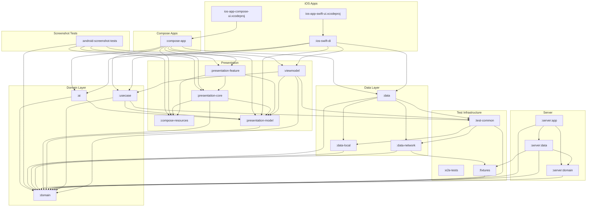
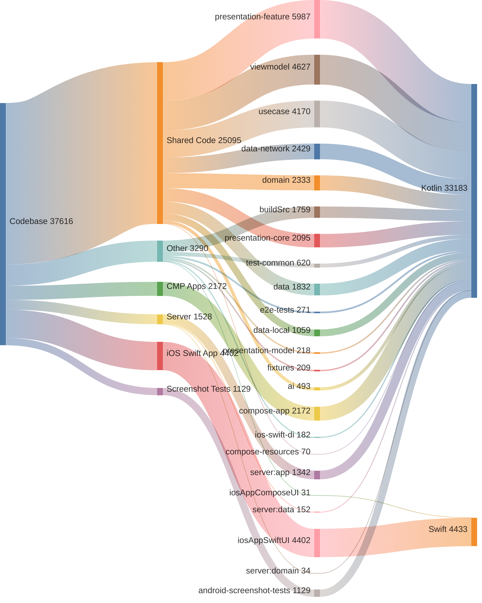

# Battery Butler

[](https://github.com/cartland/battery-butler/actions/workflows/ci.yml?query=branch%3Amain)
[](https://github.com/cartland/battery-butler/actions/workflows/release-android.yml)
<!-- Server badge (uncomment when AWS infra is re-enabled):
[](https://github.com/cartland/battery-butler/actions/workflows/server-build.yml?query=branch%3Amain)
-->
> **Server**: AWS infrastructure is hibernated. Server workflows are disabled. See [`server/README.md`](server/README.md) for the re-enable checklist.

**Battery Butler** is a Kotlin Multiplatform (KMP) application designed to help users track battery usage and replacements for their household devices. It leverages modern Android and KMP technologies including Compose Multiplatform, Room, and on-device AI integration.

## 🚀 Features

*   **Device Management**: Add, edit, and delete devices with custom attributes (name, location).
*   **Battery History**: Track battery replacement events for each device.
*   **Device Types**: Manage reusable device types (e.g., "TV Remote" uses 2x AAA batteries).
*   **AI Integration**:
    *   **Magic AI Button**: Automatically suggests device types and icons based on descriptions.
    *   **Batch Import**: Parse natural language notes (e.g., "Replaced smoke detector battery yesterday") to batch create events.
*   **Cross-Platform**: Runs on Android, iOS, and Desktop (JVM).

## 🏗 Architecture

The project follows **Clean Architecture** principles adapted for Kotlin Multiplatform.

For a detailed deep-dive into the module structure, dependency graph, and strict layer rules, please read the **[Architecture Documentation](docs/Architecture.md)**.

### Module Structure

<!-- GENERATED:BEGIN full_system_structure.mmd -->

<!-- GENERATED:END full_system_structure.mmd -->

### Code Distribution

The project spans **Kotlin**, **Swift**, and **Java** across multiple modules.
See [Code Analysis](docs/CODE_ANALYSIS.md) for the full breakdown.

<!-- GENERATED:BEGIN code_distribution.mmd -->

<!-- GENERATED:END code_distribution.mmd -->

### Tech Stack

*   **Language**: Kotlin 2.0+
*   **UI**: [Compose Multiplatform](https://github.com/JetBrains/compose-multiplatform) (Android, Desktop), SwiftUI (iOS).
*   **Dependency Injection**: [Kotlin Inject](https://github.com/evant/kotlin-inject) (Koin was previously used but migrated).
*   **Persistence**: [Room for KMP](https://developer.android.com/kotlin/multiplatform/room).
*   **Concurrency**: Kotlin Coroutines & Flow.
*   **AI**: Google AI Client SDK (Gemini) / ML Kit.
*   **Networking**: Ktor & Wire (gRPC).
*   **Date/Time**: `kotlinx-datetime`.
*   **Build Systems**: Gradle (Kotlin/Android), Bazel (Proto generation).

## 📋 Prerequisites

Before building the project, ensure you have the following installed:

| Tool | Version | Notes |
| :--- | :--- | :--- |
| **JDK** | 21+ | Required for Kotlin compilation |
| **Android Studio** | Latest stable | For Android development |
| **Xcode** | 15+ | For iOS development (macOS only) |
| **Bazel** | Latest | For proto generation (`brew install bazelisk`) |
| **Gradle** | 8.12+ | Wrapper included, no manual install needed |

## 🛠 Building and Running
This project uses Gradle for build and test orchestration.

### Common Commands
*   **Format Code**: `./scripts/format.sh` (runs `spotlessApply`)
*   **Run Tests**: `./gradlew test` (Unit) or `./gradlew pixel5api34Check` (Android Instrumented)
*   **Debug Flow**: `./scripts/run-e2e-debug-flow.sh` (Starts Server, App, and monitors logs)
*   **Update Diagram**: `./gradlew generateMermaidGraph`

### Android
*   Open the project in **Android Studio**.
*   Select the `composeApp` configuration.
*   Run on an Emulator or connected Device.

### Desktop (JVM)
*   Run the Gradle task: `./gradlew :compose-app:run`

### iOS
*   **Prerequisite**: Install Bazel for proto generation: `brew install bazelisk`
*   Open `ios-app-swift-ui/iosAppSwiftUI.xcodeproj` in **Xcode**.
*   Ensure you have built the KMP framework at least once (`./gradlew :compose-app:embedAndSignAppleFrameworkForXcode`).
*   Run on an iPhone Simulator or Device.

### Server (gRPC)
*   Run locally: `./gradlew :server:app:run` (listens on port `50051`)
*   Deploy to AWS: Push to main auto-deploys to dev. See `server/README.md` for multi-environment deployment (dev/staging/prod).

## 🔑 AI Configuration (Optional)

To enable the AI features (Gemini), you need an API Key.
1.  Obtain an API Key from [Google AI Studio](https://aistudio.google.com/).
2.  Add it to your `local.properties` file:
    ```properties
    GEMINI_API_KEY=your_api_key_here
    ```

### Server URL (Optional)

Local builds use the `PRODUCTION_SERVER_URL` value from `gradle.properties` by default. CI builds override this via the `PRODUCTION_SERVER_URL` GitHub secret (auto-synced from terraform after each deploy). To override locally:

```properties
# In gradle.properties (or pass via -P flag)
PRODUCTION_SERVER_URL=http://your-server-url:port
```

## 🔐 Google Sign-In Configuration (Optional)

Google Sign-In is disabled by default. To enable:

### 1. Google Cloud Console Setup
1. Go to [APIs & Services > Credentials](https://console.cloud.google.com/apis/credentials)
2. Create OAuth 2.0 Client ID (Web application type)
3. Copy the Client ID

### 2. Local Development
Add to `local.properties`:
```properties
GOOGLE_WEB_CLIENT_ID=123456789-abc.apps.googleusercontent.com
```

### 3. CI/CD (GitHub Actions)
Add repository secret:
- Settings > Secrets and variables > Actions > New repository secret
- Name: `GOOGLE_WEB_CLIENT_ID`
- Value: Your Web Client ID

### 4. Android: Register SHA-1 Fingerprints
```bash
# Debug fingerprint
./gradlew signingReport
```
Add the SHA-1 to your OAuth client in Google Cloud Console under "Android" application type.

## 🤝 Contributing

This project uses `Spotless` for code formatting.
Run `./scripts/format.sh` before committing to ensure your code follows the style guidelines.
Use `./scripts/prepare-for-commit.sh` to validate your changes before pushing.

For AI agents (Claude Code, etc.), see the **[Agent Guidelines](.agent/AGENTS.md)** for workflow requirements.
