# Architecture & Dependency Graph

This project follows a strict **Clean Architecture** combined with **Kotlin Multiplatform (KMP)** best practices. The codebase is modularized to separate concerns, improve build times, and enforce unidirectional data flow.

## 1. Core Philosophy

The architecture is designed to maximize code sharing for business logic and data, while embracing a hybrid UI approach. Key principles are high cohesion, low coupling, feature-based modularity, and a great developer experience.

## 2. Module Graph

The following diagrams illustrate the dependency structure between modules. Arrows indicate a dependency (e.g., `A --> B` means A depends on B).

### Kotlin Module Structure

This diagram shows all Kotlin/Gradle modules and their dependencies:



<details>
  <summary>Click to see Mermaid Source</summary>

  [Source File](diagrams/kotlin_module_structure.mmd)
</details>

### Full System Structure

This diagram includes the iOS Xcode projects and their integration with the Kotlin modules:



<details>
  <summary>Click to see Mermaid Source</summary>

  [Source File](diagrams/full_system_structure.mmd)
</details>

## 3. Module Descriptions

### Core Layers

*   **`:domain`**: The core of the application. Contains entities, repository interfaces, and pure business objects.
    *   **Dependencies**: Zero dependencies on other modules. Pure Kotlin.
    *   **Role**: Defines the "What" of the app.
    *   **Enforcement**: Strictly forbidden from importing any other module.

*   **`:ai`**: AI implementation (Gemini/ML Kit).
    *   **Dependencies**: `:domain`.
    *   **Role**: Implements `AiEngine` interface defined in Domain (or provides AI implementations). Encapsulates Generative AI logic.

*   **`:usecase`**: specific business logic scenarios (Interactors).
    *   **Dependencies**: `:domain`, `:presentation-model`, `:ai`.
    *   **Role**: Orchestrates data flow between Repositories and ViewModels. Encapsulates business rules.
    *   **Restriction**: MUST NOT depend on `:data`.

*   **`:data`** (and `:data-local`, `:data-network`): Implementation of the Data Layer.
    *   **Dependencies**: `:domain` (implements Repositories).
    *   **Role**: Manages local data persistence and networking.

### Presentation & UI Layers

*   **`:presentation-model`**: Shared UI models.
    *   **Dependencies**: `:domain`.
    *   **Role**: Simple data classes for UI state that don't depend on Android/Compose.

*   **`:viewmodel`**: KMP State Handling.
    *   **Dependencies**: `:usecase`, `:domain`, `:presentation-model`.
    *   **Role**: Manages UI state and handles user intents. Exposes `StateFlow` to UI.
    *   **Restriction**: MUST NOT depend on `:ai` or `:data`.

*   **`:presentation-core`**: Reusable Design System elements.
    *   **Dependencies**: `:domain`, `:presentation-model`, `:compose-resources`.
    *   **Role**: Theming, common widgets, basic layout components.

*   **`:presentation-feature`**: Feature-specific screens and flows.
    *   **Dependencies**: `:viewmodel`, `:presentation-core`, `:presentation-model`, `:domain`, `:compose-resources`.
    *   **Role**: Composable screens (e.g., `AddDeviceScreen`). Connects ViewModels to UI.
    *   **Restriction**: MUST NOT depend on `:ai`.

### Application Entry Points

*   **`:compose-app`**: The root Android & Desktop application.
    *   **Dependencies**: All modules (to perform Dependency Injection).
    *   **Role**: Bootstrap, DI Graph creation (`AppComponent`), Navigation host.

*   **`:ios-swift-di`** (formerly `ios-integration`): The Logic Framework for iOS.
    *   **Dependencies**: Exports `:domain`, `:viewmodel`. Dependencies on `:data`, `:usecase`.
    *   **Role**: Bundles KMP code into an iOS Framework (named `shared`). Swift code interacts with this.

### Server Side

*   **`:server:domain`**: Server-specific business logic + Common Domain.
    *   **Dependencies**: `:domain`.
    *   **Role**: Server side business entities.

*   **`:server:data`**: Server data persistence.
    *   **Dependencies**: `:server:domain`, `:domain`, `:fixtures`.
    *   **Role**: Database access for the server.

*   **`:server:app`**: The gRPC Server application.
    *   **Dependencies**: `:server:domain`, `:server:data`, `:domain`.
    *   **Role**: Runs the gRPC service, handles requests.

## 4. Strict Dependency Rules (Enforced)

The build system strictly enforces these rules via the `checkArchitecture` task.

1.  **Vertical Separation**: `UI` never communicates directly with `Data`. It must go through `ViewModel` -> `UseCase`.
2.  **Domain Purity**: `:domain` cannot see any other module.
3.  **AI Isolation**: AI types are implementation details. UI must not depend on `:ai`. Interaction goes through UseCases which return Domain types (`BatchOperationResult`).
4.  **Usecase Isolation**: `:usecase` must not depend on `:data`. It uses Repository interfaces from `:domain`.

To run the check manually:
```bash
./gradlew checkArchitecture
```

## 5. Technology Stack

*   **Language**: Kotlin 2.0+
*   **UI**: [Compose Multiplatform](https://github.com/JetBrains/compose-multiplatform) (Android, Desktop), SwiftUI (iOS).
*   **Dependency Injection**: [Kotlin Inject](https://github.com/evant/kotlin-inject).
*   **Persistence**: [Room for KMP](https://developer.android.com/kotlin/multiplatform/room).
*   **Concurrency**: Kotlin Coroutines & Flow.
*   **AI**: Google AI Client SDK (Gemini).
*   **Networking**: Wire (gRPC).
*   **Date/Time**: `kotlinx-datetime`.
