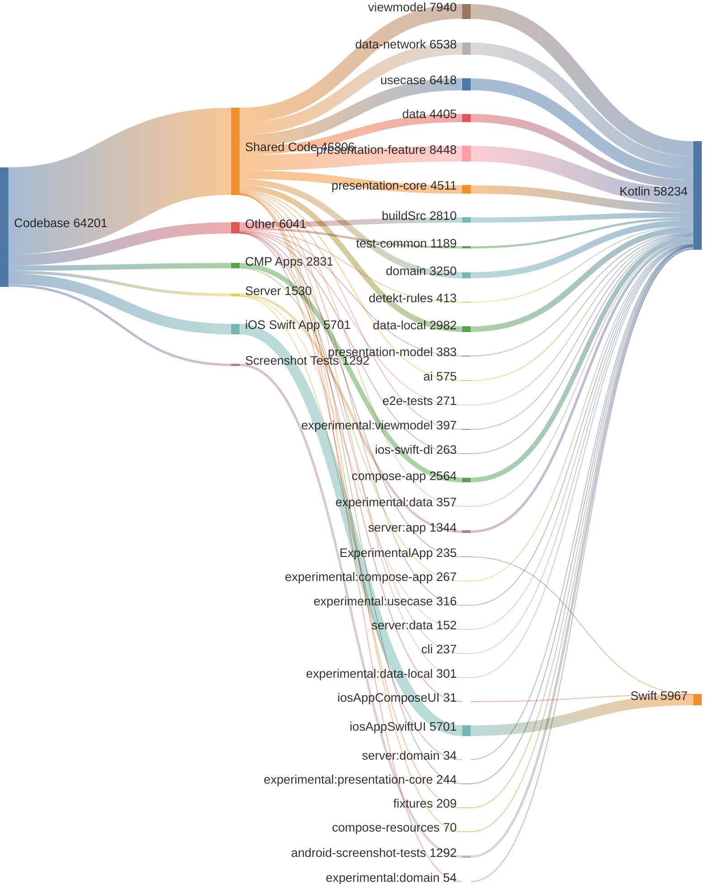

<!-- GENERATED FILE - DO NOT EDIT -->

# Code Analysis

This document provides a breakdown of the codebase by application layer and module.
Total Lines of Code: 64201

## Application Breakdown
* Shared Code: 46,806 lines (72.9%)
* Other: 6,041 lines (9.4%)
* iOS Swift App: 5,701 lines (8.9%)
* CMP Android, iOS, Desktop: 2,831 lines (4.4%)
* Server: 1,530 lines (2.4%)
* Android Screenshot Tests: 1,292 lines (2.0%)

## Module Breakdown
* `:presentation-feature`: 8,448 lines (13.2%)
* `:viewmodel`: 7,940 lines (12.4%)
* `:data-network`: 6,538 lines (10.2%)
* `:usecase`: 6,418 lines (10.0%)
* `:iosAppSwiftUI.xcodeproj`: 5,701 lines (8.9%)
* `:presentation-core`: 4,511 lines (7.0%)
* `:data`: 4,405 lines (6.9%)
* `:domain`: 3,250 lines (5.1%)
* `:data-local`: 2,982 lines (4.6%)
* `:buildSrc`: 2,810 lines (4.4%)
* `:compose-app`: 2,564 lines (4.0%)
* `:server:app`: 1,344 lines (2.1%)
* `:android-screenshot-tests`: 1,292 lines (2.0%)
* `:test-common`: 1,189 lines (1.9%)
* `:ai`: 575 lines (0.9%)
* `:detekt-rules`: 413 lines (0.6%)
* `:experimental:viewmodel`: 397 lines (0.6%)
* `:presentation-model`: 383 lines (0.6%)
* `:experimental:data`: 357 lines (0.6%)
* `:experimental:usecase`: 316 lines (0.5%)
* `:experimental:data-local`: 301 lines (0.5%)
* `:e2e-tests`: 271 lines (0.4%)
* `:experimental:compose-app`: 267 lines (0.4%)
* `:ios-swift-di`: 263 lines (0.4%)
* `:experimental:presentation-core`: 244 lines (0.4%)
* `:cli`: 237 lines (0.4%)
* `:ExperimentalApp.xcodeproj`: 235 lines (0.4%)
* `:fixtures`: 209 lines (0.3%)
* `:server:data`: 152 lines (0.2%)
* `:compose-resources`: 70 lines (0.1%)
* `:experimental:domain`: 54 lines (0.1%)
* `:server:domain`: 34 lines (0.1%)
* `:iosAppComposeUI.xcodeproj`: 31 lines (0.0%)

## Language Breakdown
* Kotlin (.kt): 58,234 lines (90.7%)
* Swift (.swift): 5,967 lines (9.3%)

## Code Distribution

<!-- GENERATED:BEGIN code_distribution.mmd -->

<!-- GENERATED:END code_distribution.mmd -->

