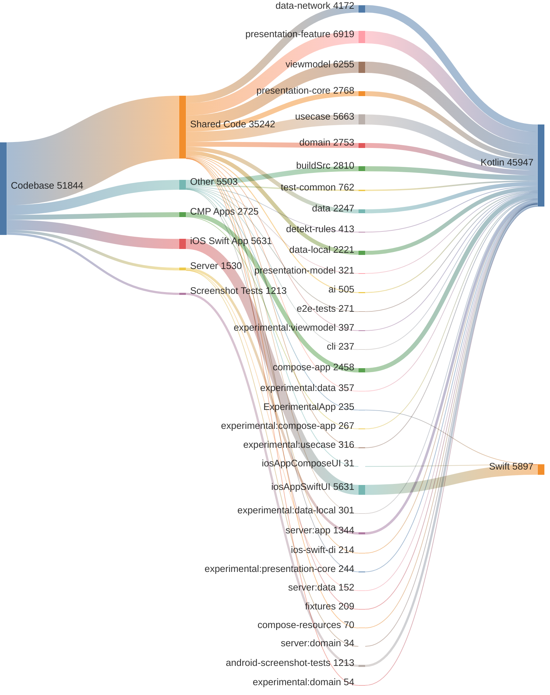

<!-- GENERATED FILE - DO NOT EDIT -->

# Code Analysis

This document provides a breakdown of the codebase by application layer and module.
Total Lines of Code: 51844

## Application Breakdown
* Shared Code: 35,242 lines (68.0%)
* iOS Swift App: 5,631 lines (10.9%)
* Other: 5,503 lines (10.6%)
* CMP Android, iOS, Desktop: 2,725 lines (5.3%)
* Server: 1,530 lines (3.0%)
* Android Screenshot Tests: 1,213 lines (2.3%)

## Module Breakdown
* `:presentation-feature`: 6,919 lines (13.3%)
* `:viewmodel`: 6,255 lines (12.1%)
* `:usecase`: 5,663 lines (10.9%)
* `:iosAppSwiftUI.xcodeproj`: 5,631 lines (10.9%)
* `:data-network`: 4,172 lines (8.0%)
* `:buildSrc`: 2,810 lines (5.4%)
* `:presentation-core`: 2,768 lines (5.3%)
* `:domain`: 2,753 lines (5.3%)
* `:compose-app`: 2,458 lines (4.7%)
* `:data`: 2,247 lines (4.3%)
* `:data-local`: 2,221 lines (4.3%)
* `:server:app`: 1,344 lines (2.6%)
* `:android-screenshot-tests`: 1,213 lines (2.3%)
* `:test-common`: 762 lines (1.5%)
* `:ai`: 505 lines (1.0%)
* `:detekt-rules`: 413 lines (0.8%)
* `:experimental:viewmodel`: 397 lines (0.8%)
* `:experimental:data`: 357 lines (0.7%)
* `:presentation-model`: 321 lines (0.6%)
* `:experimental:usecase`: 316 lines (0.6%)
* `:experimental:data-local`: 301 lines (0.6%)
* `:e2e-tests`: 271 lines (0.5%)
* `:experimental:compose-app`: 267 lines (0.5%)
* `:experimental:presentation-core`: 244 lines (0.5%)
* `:cli`: 237 lines (0.5%)
* `:ExperimentalApp.xcodeproj`: 235 lines (0.5%)
* `:ios-swift-di`: 214 lines (0.4%)
* `:fixtures`: 209 lines (0.4%)
* `:server:data`: 152 lines (0.3%)
* `:compose-resources`: 70 lines (0.1%)
* `:experimental:domain`: 54 lines (0.1%)
* `:server:domain`: 34 lines (0.1%)
* `:iosAppComposeUI.xcodeproj`: 31 lines (0.1%)

## Language Breakdown
* Kotlin (.kt): 45,947 lines (88.6%)
* Swift (.swift): 5,897 lines (11.4%)

## Code Distribution

<!-- GENERATED:BEGIN code_distribution.mmd -->

<!-- GENERATED:END code_distribution.mmd -->

