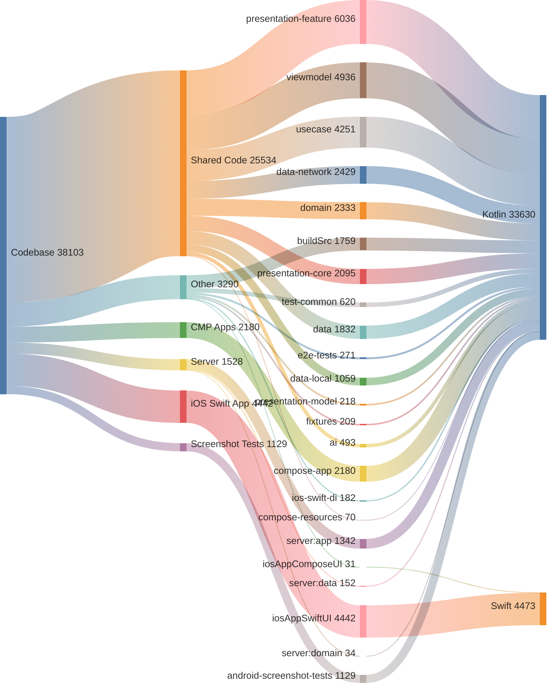

<!-- GENERATED FILE - DO NOT EDIT -->

# Code Analysis

This document provides a breakdown of the codebase by application layer and module.
Total Lines of Code: 38103

## Application Breakdown
* Shared Code: 25,534 lines (67.0%)
* iOS Swift App: 4,442 lines (11.7%)
* Other: 3,290 lines (8.6%)
* CMP Android, iOS, Desktop: 2,180 lines (5.7%)
* Server: 1,528 lines (4.0%)
* Android Screenshot Tests: 1,129 lines (3.0%)

## Module Breakdown
* `:presentation-feature`: 6,036 lines (15.8%)
* `:viewmodel`: 4,936 lines (13.0%)
* `:iosAppSwiftUI.xcodeproj`: 4,442 lines (11.7%)
* `:usecase`: 4,251 lines (11.2%)
* `:data-network`: 2,429 lines (6.4%)
* `:domain`: 2,333 lines (6.1%)
* `:compose-app`: 2,180 lines (5.7%)
* `:presentation-core`: 2,095 lines (5.5%)
* `:data`: 1,832 lines (4.8%)
* `:buildSrc`: 1,759 lines (4.6%)
* `:server:app`: 1,342 lines (3.5%)
* `:android-screenshot-tests`: 1,129 lines (3.0%)
* `:data-local`: 1,059 lines (2.8%)
* `:test-common`: 620 lines (1.6%)
* `:ai`: 493 lines (1.3%)
* `:e2e-tests`: 271 lines (0.7%)
* `:presentation-model`: 218 lines (0.6%)
* `:fixtures`: 209 lines (0.5%)
* `:ios-swift-di`: 182 lines (0.5%)
* `:server:data`: 152 lines (0.4%)
* `:compose-resources`: 70 lines (0.2%)
* `:server:domain`: 34 lines (0.1%)
* `:iosAppComposeUI.xcodeproj`: 31 lines (0.1%)

## Language Breakdown
* Kotlin (.kt): 33,630 lines (88.3%)
* Swift (.swift): 4,473 lines (11.7%)

## Code Distribution

<!-- GENERATED:BEGIN code_distribution.mmd -->

<!-- GENERATED:END code_distribution.mmd -->

