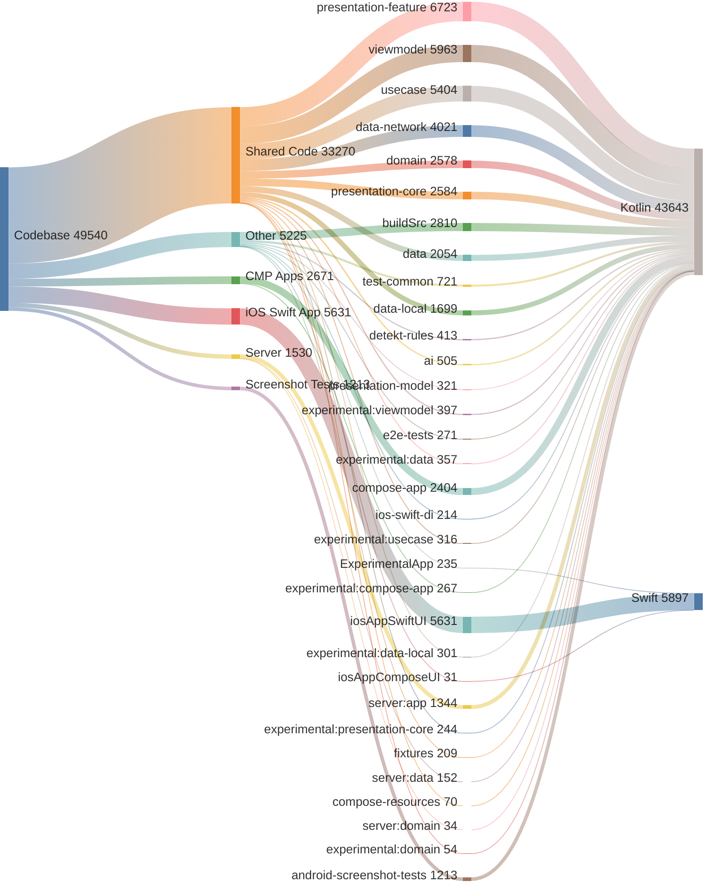

<!-- GENERATED FILE - DO NOT EDIT -->

# Code Analysis

This document provides a breakdown of the codebase by application layer and module.
Total Lines of Code: 49540

## Application Breakdown
* Shared Code: 33,270 lines (67.2%)
* iOS Swift App: 5,631 lines (11.4%)
* Other: 5,225 lines (10.5%)
* CMP Android, iOS, Desktop: 2,671 lines (5.4%)
* Server: 1,530 lines (3.1%)
* Android Screenshot Tests: 1,213 lines (2.4%)

## Module Breakdown
* `:presentation-feature`: 6,723 lines (13.6%)
* `:viewmodel`: 5,963 lines (12.0%)
* `:iosAppSwiftUI.xcodeproj`: 5,631 lines (11.4%)
* `:usecase`: 5,404 lines (10.9%)
* `:data-network`: 4,021 lines (8.1%)
* `:buildSrc`: 2,810 lines (5.7%)
* `:presentation-core`: 2,584 lines (5.2%)
* `:domain`: 2,578 lines (5.2%)
* `:compose-app`: 2,404 lines (4.9%)
* `:data`: 2,054 lines (4.1%)
* `:data-local`: 1,699 lines (3.4%)
* `:server:app`: 1,344 lines (2.7%)
* `:android-screenshot-tests`: 1,213 lines (2.4%)
* `:test-common`: 721 lines (1.5%)
* `:ai`: 505 lines (1.0%)
* `:detekt-rules`: 413 lines (0.8%)
* `:experimental:viewmodel`: 397 lines (0.8%)
* `:experimental:data`: 357 lines (0.7%)
* `:presentation-model`: 321 lines (0.6%)
* `:experimental:usecase`: 316 lines (0.6%)
* `:experimental:data-local`: 301 lines (0.6%)
* `:e2e-tests`: 271 lines (0.5%)
* `:experimental:compose-app`: 267 lines (0.5%)
* `:experimental:presentation-core`: 244 lines (0.5%)
* `:ExperimentalApp.xcodeproj`: 235 lines (0.5%)
* `:ios-swift-di`: 214 lines (0.4%)
* `:fixtures`: 209 lines (0.4%)
* `:server:data`: 152 lines (0.3%)
* `:compose-resources`: 70 lines (0.1%)
* `:experimental:domain`: 54 lines (0.1%)
* `:server:domain`: 34 lines (0.1%)
* `:iosAppComposeUI.xcodeproj`: 31 lines (0.1%)

## Language Breakdown
* Kotlin (.kt): 43,643 lines (88.1%)
* Swift (.swift): 5,897 lines (11.9%)

## Code Distribution

<!-- GENERATED:BEGIN code_distribution.mmd -->

<!-- GENERATED:END code_distribution.mmd -->

