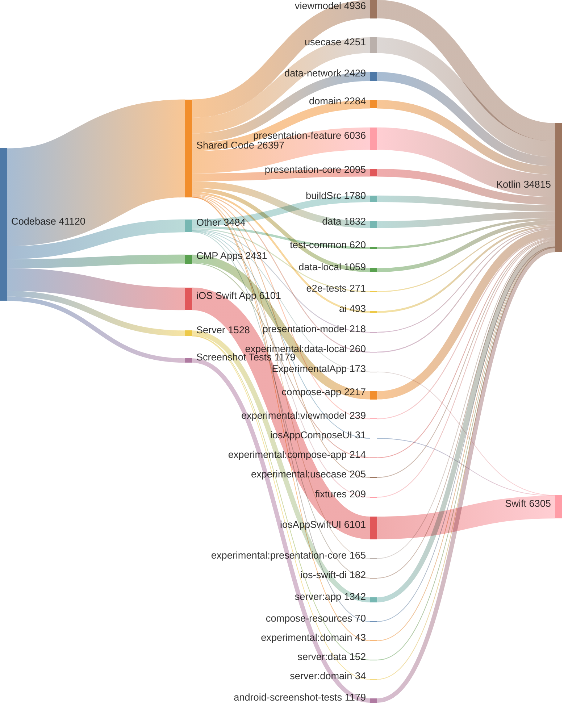

<!-- GENERATED FILE - DO NOT EDIT -->

# Code Analysis

This document provides a breakdown of the codebase by application layer and module.
Total Lines of Code: 41120

## Application Breakdown
* Shared Code: 26,397 lines (64.2%)
* iOS Swift App: 6,101 lines (14.8%)
* Other: 3,484 lines (8.5%)
* CMP Android, iOS, Desktop: 2,431 lines (5.9%)
* Server: 1,528 lines (3.7%)
* Android Screenshot Tests: 1,179 lines (2.9%)

## Module Breakdown
* `:iosAppSwiftUI.xcodeproj`: 6,101 lines (14.8%)
* `:presentation-feature`: 6,036 lines (14.7%)
* `:viewmodel`: 4,936 lines (12.0%)
* `:usecase`: 4,251 lines (10.3%)
* `:data-network`: 2,429 lines (5.9%)
* `:domain`: 2,284 lines (5.6%)
* `:compose-app`: 2,217 lines (5.4%)
* `:presentation-core`: 2,095 lines (5.1%)
* `:data`: 1,832 lines (4.5%)
* `:buildSrc`: 1,780 lines (4.3%)
* `:server:app`: 1,342 lines (3.3%)
* `:android-screenshot-tests`: 1,179 lines (2.9%)
* `:data-local`: 1,059 lines (2.6%)
* `:test-common`: 620 lines (1.5%)
* `:ai`: 493 lines (1.2%)
* `:e2e-tests`: 271 lines (0.7%)
* `:experimental:data-local`: 260 lines (0.6%)
* `:experimental:viewmodel`: 239 lines (0.6%)
* `:presentation-model`: 218 lines (0.5%)
* `:experimental:compose-app`: 214 lines (0.5%)
* `:fixtures`: 209 lines (0.5%)
* `:experimental:usecase`: 205 lines (0.5%)
* `:ios-swift-di`: 182 lines (0.4%)
* `:ExperimentalApp.xcodeproj`: 173 lines (0.4%)
* `:experimental:presentation-core`: 165 lines (0.4%)
* `:server:data`: 152 lines (0.4%)
* `:compose-resources`: 70 lines (0.2%)
* `:experimental:domain`: 43 lines (0.1%)
* `:server:domain`: 34 lines (0.1%)
* `:iosAppComposeUI.xcodeproj`: 31 lines (0.1%)

## Language Breakdown
* Kotlin (.kt): 34,815 lines (84.7%)
* Swift (.swift): 6,305 lines (15.3%)

## Code Distribution

<!-- GENERATED:BEGIN code_distribution.mmd -->

<!-- GENERATED:END code_distribution.mmd -->

