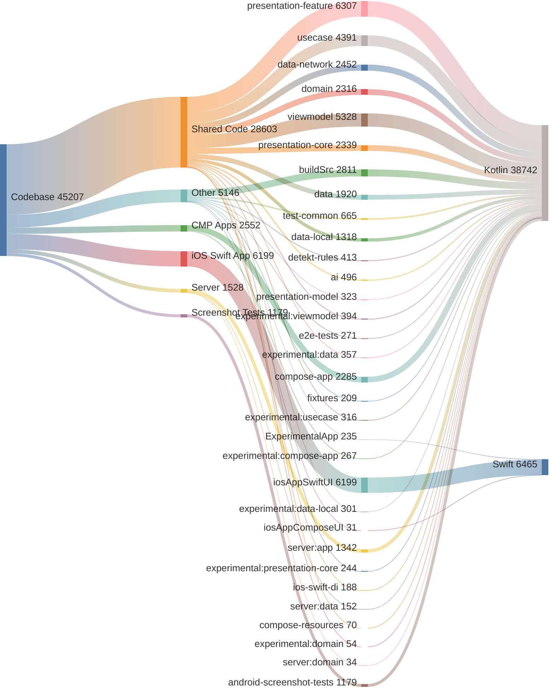

<!-- GENERATED FILE - DO NOT EDIT -->

# Code Analysis

This document provides a breakdown of the codebase by application layer and module.
Total Lines of Code: 45207

## Application Breakdown
* Shared Code: 28,603 lines (63.3%)
* iOS Swift App: 6,199 lines (13.7%)
* Other: 5,146 lines (11.4%)
* CMP Android, iOS, Desktop: 2,552 lines (5.6%)
* Server: 1,528 lines (3.4%)
* Android Screenshot Tests: 1,179 lines (2.6%)

## Module Breakdown
* `:presentation-feature`: 6,307 lines (14.0%)
* `:iosAppSwiftUI.xcodeproj`: 6,199 lines (13.7%)
* `:viewmodel`: 5,328 lines (11.8%)
* `:usecase`: 4,391 lines (9.7%)
* `:buildSrc`: 2,811 lines (6.2%)
* `:data-network`: 2,452 lines (5.4%)
* `:presentation-core`: 2,339 lines (5.2%)
* `:domain`: 2,316 lines (5.1%)
* `:compose-app`: 2,285 lines (5.1%)
* `:data`: 1,920 lines (4.2%)
* `:server:app`: 1,342 lines (3.0%)
* `:data-local`: 1,318 lines (2.9%)
* `:android-screenshot-tests`: 1,179 lines (2.6%)
* `:test-common`: 665 lines (1.5%)
* `:ai`: 496 lines (1.1%)
* `:detekt-rules`: 413 lines (0.9%)
* `:experimental:viewmodel`: 394 lines (0.9%)
* `:experimental:data`: 357 lines (0.8%)
* `:presentation-model`: 323 lines (0.7%)
* `:experimental:usecase`: 316 lines (0.7%)
* `:experimental:data-local`: 301 lines (0.7%)
* `:e2e-tests`: 271 lines (0.6%)
* `:experimental:compose-app`: 267 lines (0.6%)
* `:experimental:presentation-core`: 244 lines (0.5%)
* `:ExperimentalApp.xcodeproj`: 235 lines (0.5%)
* `:fixtures`: 209 lines (0.5%)
* `:ios-swift-di`: 188 lines (0.4%)
* `:server:data`: 152 lines (0.3%)
* `:compose-resources`: 70 lines (0.2%)
* `:experimental:domain`: 54 lines (0.1%)
* `:server:domain`: 34 lines (0.1%)
* `:iosAppComposeUI.xcodeproj`: 31 lines (0.1%)

## Language Breakdown
* Kotlin (.kt): 38,742 lines (85.7%)
* Swift (.swift): 6,465 lines (14.3%)

## Code Distribution

<!-- GENERATED:BEGIN code_distribution.mmd -->

<!-- GENERATED:END code_distribution.mmd -->

