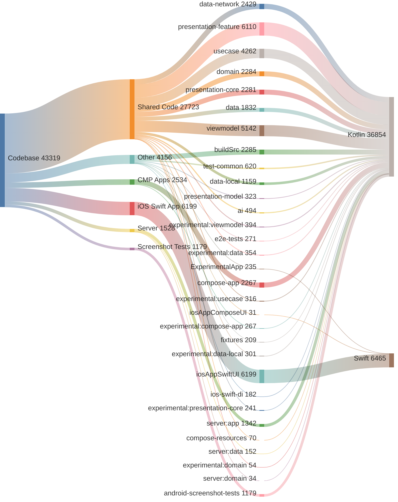

<!-- GENERATED FILE - DO NOT EDIT -->

# Code Analysis

This document provides a breakdown of the codebase by application layer and module.
Total Lines of Code: 43319

## Application Breakdown
* Shared Code: 27,723 lines (64.0%)
* iOS Swift App: 6,199 lines (14.3%)
* Other: 4,156 lines (9.6%)
* CMP Android, iOS, Desktop: 2,534 lines (5.8%)
* Server: 1,528 lines (3.5%)
* Android Screenshot Tests: 1,179 lines (2.7%)

## Module Breakdown
* `:iosAppSwiftUI.xcodeproj`: 6,199 lines (14.3%)
* `:presentation-feature`: 6,110 lines (14.1%)
* `:viewmodel`: 5,142 lines (11.9%)
* `:usecase`: 4,262 lines (9.8%)
* `:data-network`: 2,429 lines (5.6%)
* `:buildSrc`: 2,285 lines (5.3%)
* `:domain`: 2,284 lines (5.3%)
* `:presentation-core`: 2,281 lines (5.3%)
* `:compose-app`: 2,267 lines (5.2%)
* `:data`: 1,832 lines (4.2%)
* `:server:app`: 1,342 lines (3.1%)
* `:android-screenshot-tests`: 1,179 lines (2.7%)
* `:data-local`: 1,159 lines (2.7%)
* `:test-common`: 620 lines (1.4%)
* `:ai`: 494 lines (1.1%)
* `:experimental:viewmodel`: 394 lines (0.9%)
* `:experimental:data`: 354 lines (0.8%)
* `:presentation-model`: 323 lines (0.7%)
* `:experimental:usecase`: 316 lines (0.7%)
* `:experimental:data-local`: 301 lines (0.7%)
* `:e2e-tests`: 271 lines (0.6%)
* `:experimental:compose-app`: 267 lines (0.6%)
* `:experimental:presentation-core`: 241 lines (0.6%)
* `:ExperimentalApp.xcodeproj`: 235 lines (0.5%)
* `:fixtures`: 209 lines (0.5%)
* `:ios-swift-di`: 182 lines (0.4%)
* `:server:data`: 152 lines (0.4%)
* `:compose-resources`: 70 lines (0.2%)
* `:experimental:domain`: 54 lines (0.1%)
* `:server:domain`: 34 lines (0.1%)
* `:iosAppComposeUI.xcodeproj`: 31 lines (0.1%)

## Language Breakdown
* Kotlin (.kt): 36,854 lines (85.1%)
* Swift (.swift): 6,465 lines (14.9%)

## Code Distribution

<!-- GENERATED:BEGIN code_distribution.mmd -->

<!-- GENERATED:END code_distribution.mmd -->

