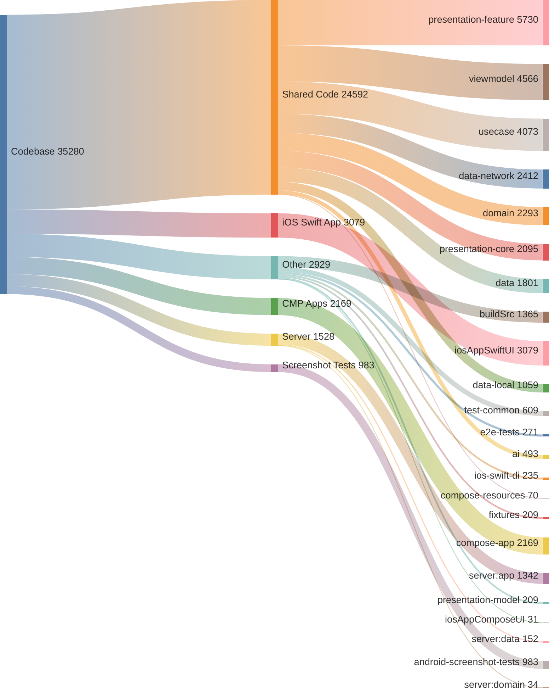

# Code Share Analysis

This document provides a breakdown of the codebase by application layer and module.
Total Lines of Code: 35280

## Application Breakdown
* Shared Code: 24,592 lines (69.7%)
* iOS Swift App: 3,079 lines (8.7%)
* Other: 2,929 lines (8.3%)
* CMP Android, iOS, Desktop: 2,169 lines (6.1%)
* Server: 1,528 lines (4.3%)
* Android Screenshot Tests: 983 lines (2.8%)

## Module Breakdown
* `:presentation-feature`: 5,730 lines (16.2%)
* `:viewmodel`: 4,566 lines (12.9%)
* `:usecase`: 4,073 lines (11.5%)
* `:iosAppSwiftUI.xcodeproj`: 3,079 lines (8.7%)
* `:data-network`: 2,412 lines (6.8%)
* `:domain`: 2,293 lines (6.5%)
* `:compose-app`: 2,169 lines (6.1%)
* `:presentation-core`: 2,095 lines (5.9%)
* `:data`: 1,801 lines (5.1%)
* `:buildSrc`: 1,365 lines (3.9%)
* `:server:app`: 1,342 lines (3.8%)
* `:data-local`: 1,059 lines (3.0%)
* `:android-screenshot-tests`: 983 lines (2.8%)
* `:test-common`: 609 lines (1.7%)
* `:ai`: 493 lines (1.4%)
* `:e2e-tests`: 271 lines (0.8%)
* `:ios-swift-di`: 235 lines (0.7%)
* `:fixtures`: 209 lines (0.6%)
* `:presentation-model`: 209 lines (0.6%)
* `:server:data`: 152 lines (0.4%)
* `:compose-resources`: 70 lines (0.2%)
* `:server:domain`: 34 lines (0.1%)
* `:iosAppComposeUI.xcodeproj`: 31 lines (0.1%)

## Code Distribution

