<!-- GENERATED FILE - DO NOT EDIT -->

# iOS Screenshot Gallery

Generated on 2026-03-10 05:35:50 UTC

## Table of Contents

- [AddBatteryEventScreenTests](#addbatteryeventscreentests)
- [AddDeviceScreenTests](#adddevicescreentests)
- [AddDeviceTypeScreenTests](#adddevicetypescreentests)
- [AiChatScreenTests](#aichatscreentests)
- [DeviceDetailScreenTests](#devicedetailscreentests)
- [DeviceRowTests](#devicerowtests)
- [DeviceTypeDetailScreenTests](#devicetypedetailscreentests)
- [DeviceTypeListScreenTests](#devicetypelistscreentests)
- [DeviceTypeRowTests](#devicetyperowtests)
- [EditBatteryEventScreenTests](#editbatteryeventscreentests)
- [EditDeviceScreenTests](#editdevicescreentests)
- [EditDeviceTypeScreenTests](#editdevicetypescreentests)
- [EventDetailScreenTests](#eventdetailscreentests)
- [HistoryListScreenTests](#historylistscreentests)
- [HomeScreenTests](#homescreentests)
- [LoginScreenTests](#loginscreentests)
- [MessageRowTests](#messagerowtests)
- [SettingsScreenTests](#settingsscreentests)
- [SimpleSnapshotTests](#simplesnapshottests)

## AddBatteryEventScreenTests

### testAddBatteryEventContentView_Empty

| Light | Dark |
|-------|------|
| 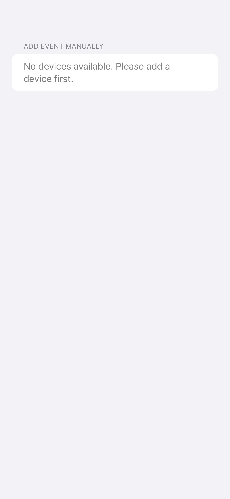 |  |

### testAddBatteryEventContentView_WithDevices

| Light | Dark |
|-------|------|
|  |  |

## AddDeviceScreenTests

### testAddDeviceContentView_Empty

| Light | Dark |
|-------|------|
| 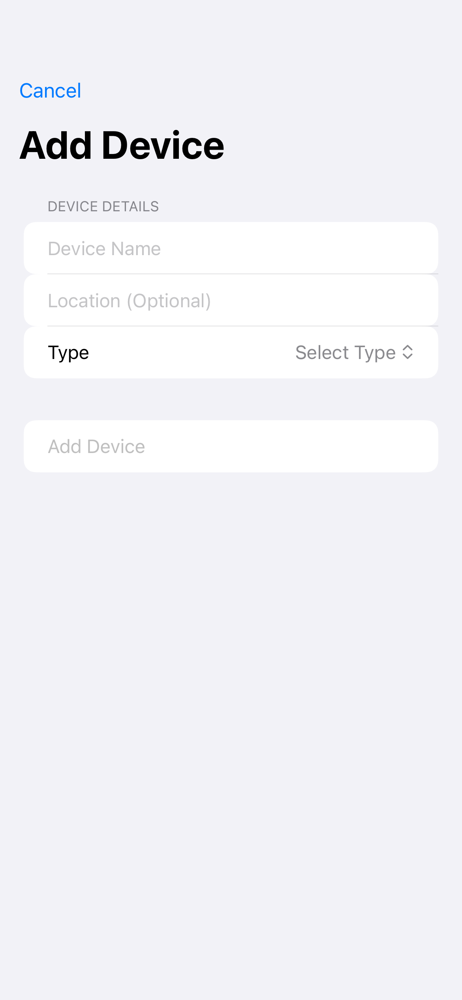 |  |

### testAddDeviceContentView_Filled

| Light | Dark |
|-------|------|
|  |  |

## AddDeviceTypeScreenTests

### testAddDeviceTypeContentView_Empty

| Light | Dark |
|-------|------|
|  |  |

### testAddDeviceTypeContentView_Error

| Light | Dark |
|-------|------|
|  | 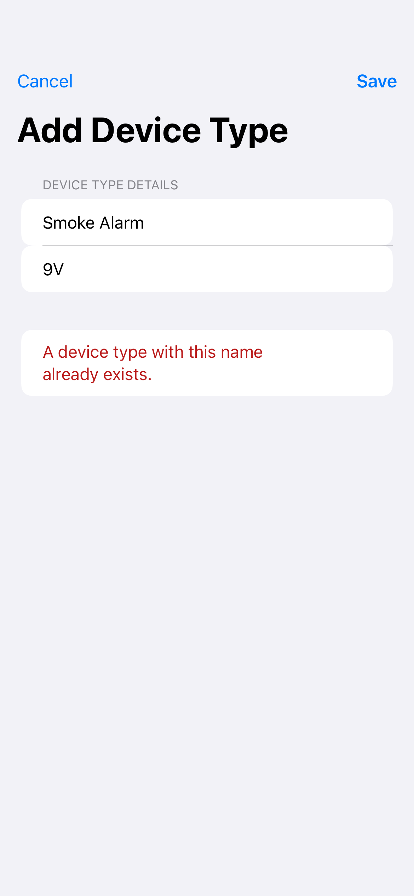 |

### testAddDeviceTypeContentView_Filled

| Light | Dark |
|-------|------|
| 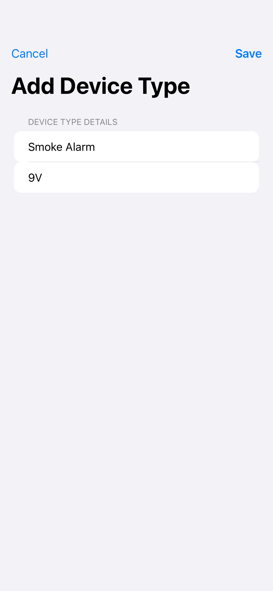 |  |

## AiChatScreenTests

### testAiChatContentView_Empty

| Light | Dark |
|-------|------|
|  |  |

### testAiChatContentView_WithMessages

| Light | Dark |
|-------|------|
| 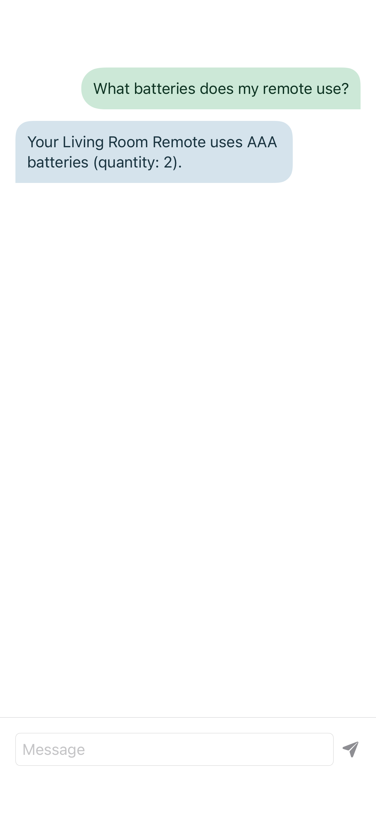 |  |

## DeviceDetailScreenTests

### testDeviceDetailContentView_Loading

| Light | Dark |
|-------|------|
|  |  |

### testDeviceDetailContentView_NotFound

| Light | Dark |
|-------|------|
|  |  |

### testDeviceDetailContentView_Success

| Light | Dark |
|-------|------|
| 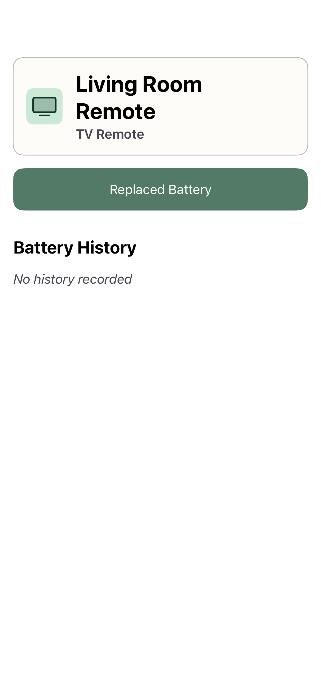 |  |

## DeviceRowTests

### testDeviceRow_NilDeviceType

| Light | Dark |
|-------|------|
|  |  |

### testDeviceRow_WithLocation

| Light | Dark |
|-------|------|
|  |  |

### testDeviceRow_WithoutLocation

| Light | Dark |
|-------|------|
|  |  |

## DeviceTypeDetailScreenTests

### testDeviceTypeDetailContentView_Loading

| Light | Dark |
|-------|------|
|  |  |

### testDeviceTypeDetailContentView_NotFound

| Light | Dark |
|-------|------|
|  |  |

### testDeviceTypeDetailContentView_Success

| Light | Dark |
|-------|------|
|  | 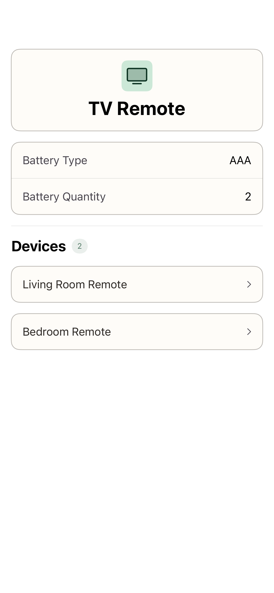 |

## DeviceTypeListScreenTests

### testDeviceTypeListContentView_Empty

| Light | Dark |
|-------|------|
|  | 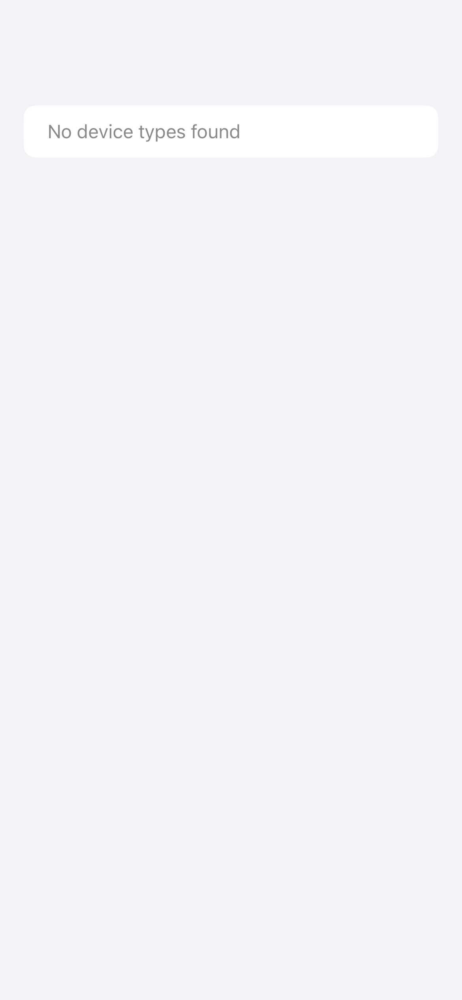 |

### testDeviceTypeListContentView_Loading

| Light | Dark |
|-------|------|
|  |  |

### testDeviceTypeListContentView_Success

| Light | Dark |
|-------|------|
| 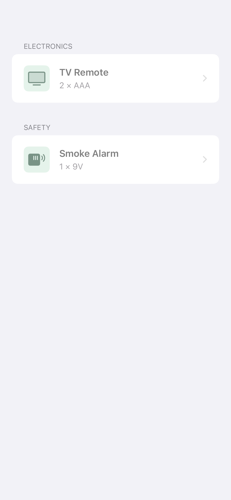 |  |

## DeviceTypeRowTests

### testDeviceTypeRow_WithBatteryType

| Light | Dark |
|-------|------|
|  |  |

### testDeviceTypeRow_WithoutBatteryType

| Light | Dark |
|-------|------|
|  |  |

## EditBatteryEventScreenTests

### testEditBatteryEventContentView_Loading

| Light | Dark |
|-------|------|
|  | 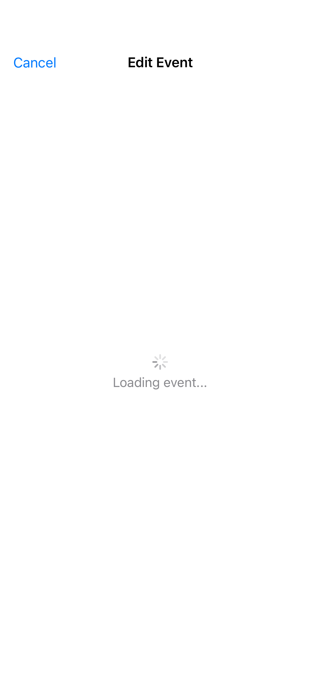 |

### testEditBatteryEventContentView_NotFound

| Light | Dark |
|-------|------|
|  | 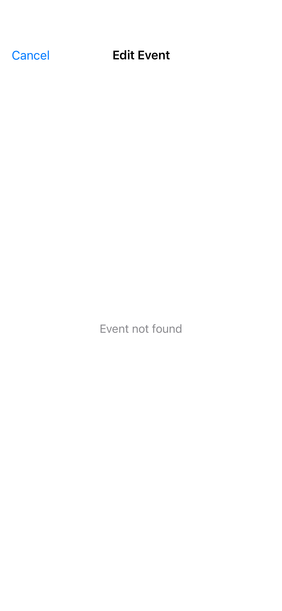 |

### testEditBatteryEventContentView_Success

| Light | Dark |
|-------|------|
|  | 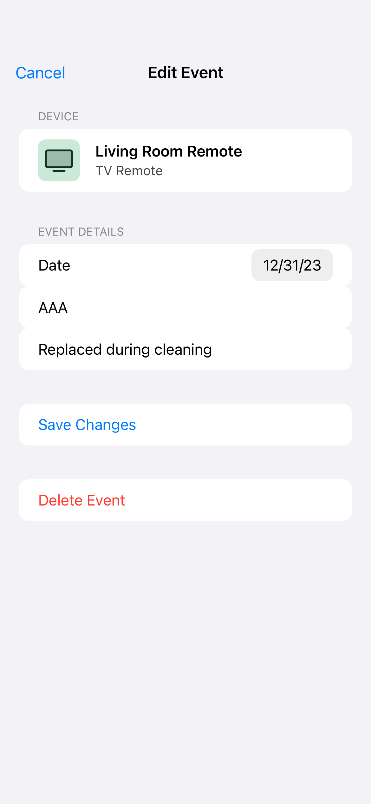 |

## EditDeviceScreenTests

### testEditDeviceContentView_Loading

| Light | Dark |
|-------|------|
|  |  |

### testEditDeviceContentView_NotFound

| Light | Dark |
|-------|------|
| 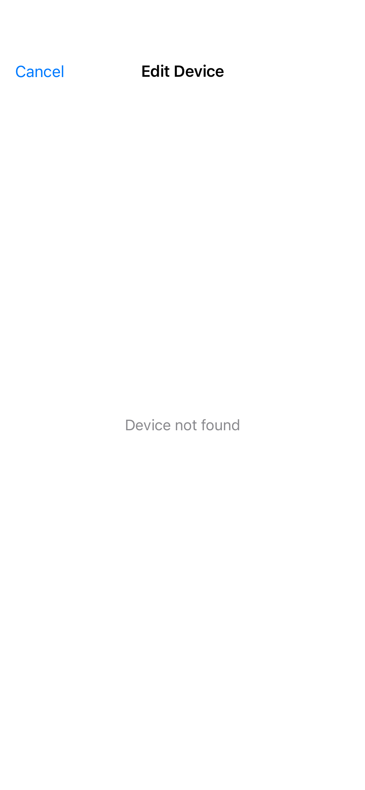 |  |

### testEditDeviceContentView_Success

| Light | Dark |
|-------|------|
|  |  |

## EditDeviceTypeScreenTests

### testEditDeviceTypeContentView_Loaded

| Light | Dark |
|-------|------|
|  |  |

### testEditDeviceTypeContentView_Loading

| Light | Dark |
|-------|------|
|  |  |

### testEditDeviceTypeContentView_NotFound

| Light | Dark |
|-------|------|
|  |  |

## EventDetailScreenTests

### testEventDetailContentView_DeletedDevice

| Light | Dark |
|-------|------|
|  | 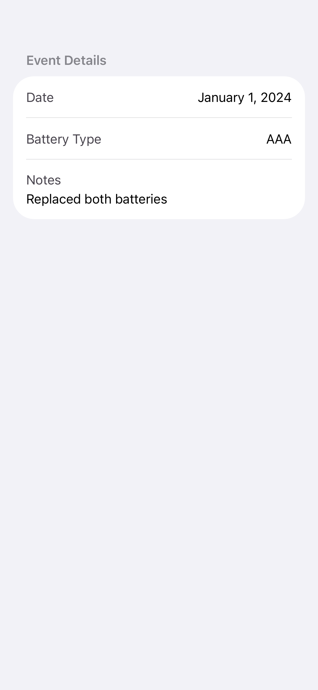 |

### testEventDetailContentView_Loading

| Light | Dark |
|-------|------|
|  |  |

### testEventDetailContentView_NotFound

| Light | Dark |
|-------|------|
|  |  |

### testEventDetailContentView_Success

| Light | Dark |
|-------|------|
|  | 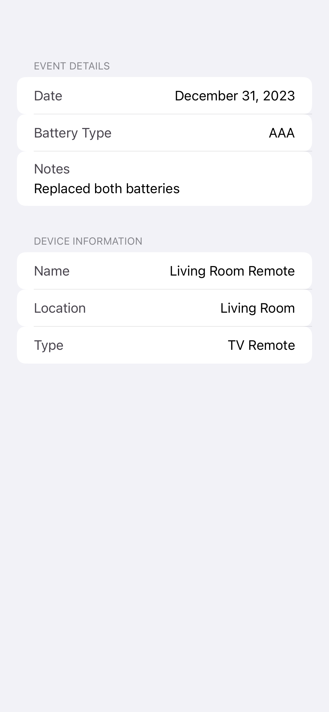 |

## HistoryListScreenTests

### testHistoryListContentView_Empty

| Light | Dark |
|-------|------|
|  |  |

### testHistoryListContentView_Loading

| Light | Dark |
|-------|------|
|  |  |

### testHistoryListContentView_Success

| Light | Dark |
|-------|------|
| 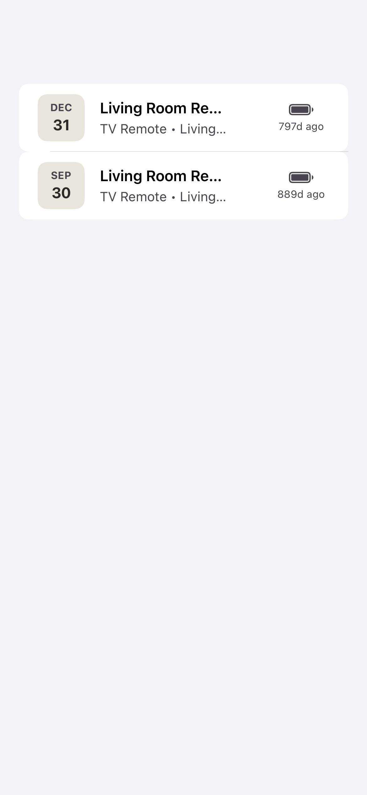 |  |

## HomeScreenTests

### testHomeContentView_Empty

| Light | Dark |
|-------|------|
|  | 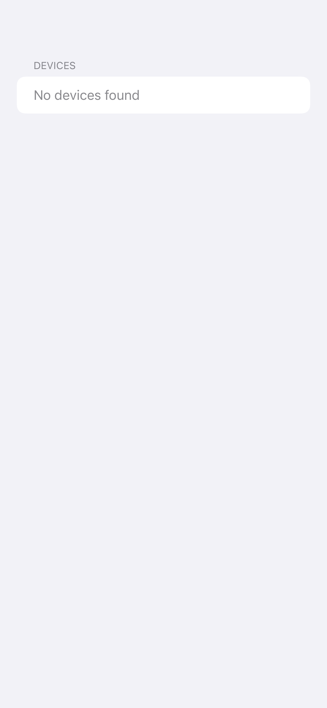 |

### testHomeContentView_WithDevices

| Light | Dark |
|-------|------|
|  | 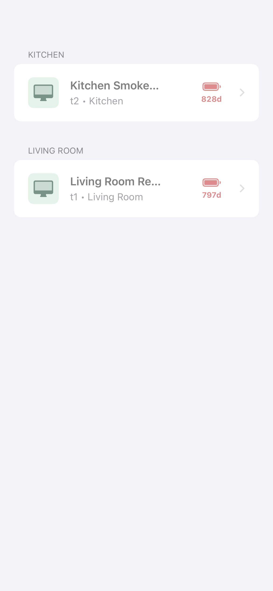 |

## LoginScreenTests

### testLoginContentView_Authenticating

| Light | Dark |
|-------|------|
| 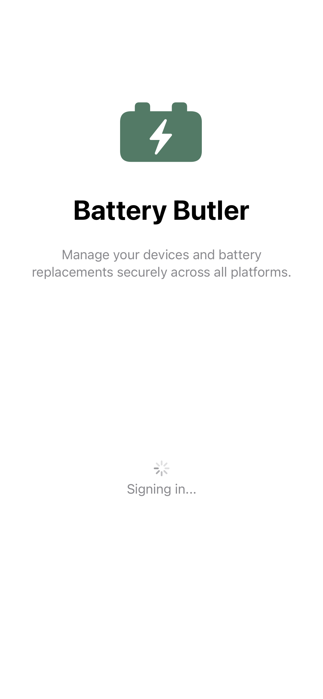 |  |

### testLoginContentView_Default

| Light | Dark |
|-------|------|
|  | 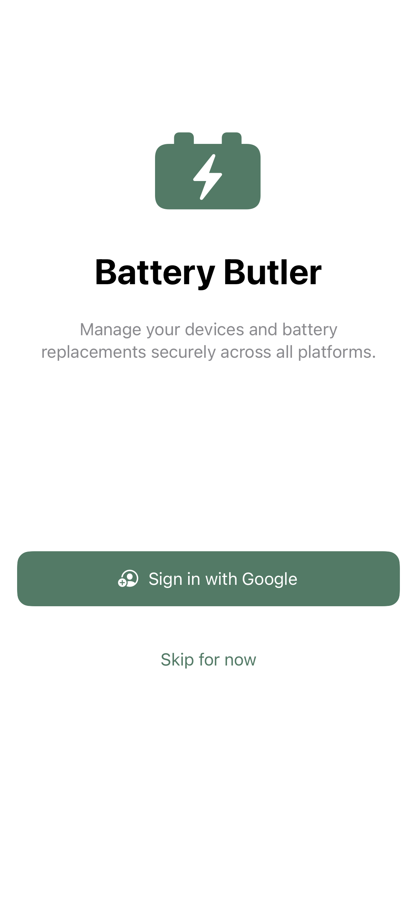 |

### testLoginContentView_NotConfigured

| Light | Dark |
|-------|------|
|  |  |

## MessageRowTests

### testMessageRow_ModelMessage

| Light | Dark |
|-------|------|
| 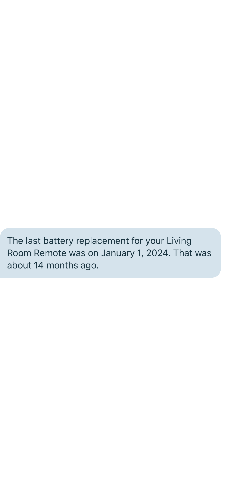 |  |

### testMessageRow_UserMessage

| Light | Dark |
|-------|------|
|  | 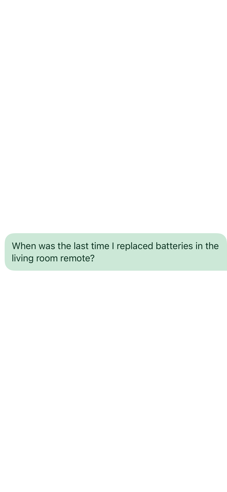 |

## SettingsScreenTests

### testSettingsContentView_Default

| Light | Dark |
|-------|------|
|  | 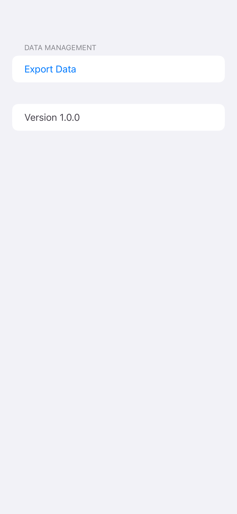 |

## SimpleSnapshotTests

### testSimpleView

| Light | Dark |
|-------|------|
|  |  |

