# iOS Screenshot Gallery

Generated on 2026-03-07 06:54:06 UTC

## Table of Contents

- [AddBatteryEventScreenTests](#addbatteryeventscreentests)
- [AddDeviceScreenTests](#adddevicescreentests)
- [AddDeviceTypeScreenTests](#adddevicetypescreentests)
- [AiChatScreenTests](#aichatscreentests)
- [DeviceDetailScreenTests](#devicedetailscreentests)
- [DeviceRowTests](#devicerowtests)
- [DeviceTypeListScreenTests](#devicetypelistscreentests)
- [DeviceTypeRowTests](#devicetyperowtests)
- [EditDeviceScreenTests](#editdevicescreentests)
- [EditDeviceTypeScreenTests](#editdevicetypescreentests)
- [EventDetailScreenTests](#eventdetailscreentests)
- [HistoryListScreenTests](#historylistscreentests)
- [HomeScreenTests](#homescreentests)
- [LoginScreenTests](#loginscreentests)
- [MessageRowTests](#messagerowtests)
- [SettingsScreenTests](#settingsscreentests)
- [SimpleSnapshotTests](#simplesnapshottests)

## AddBatteryEventScreenTests

### testAddBatteryEventContentView_Empty

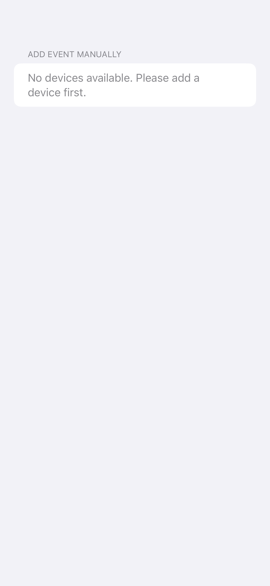

### testAddBatteryEventContentView_WithDevices

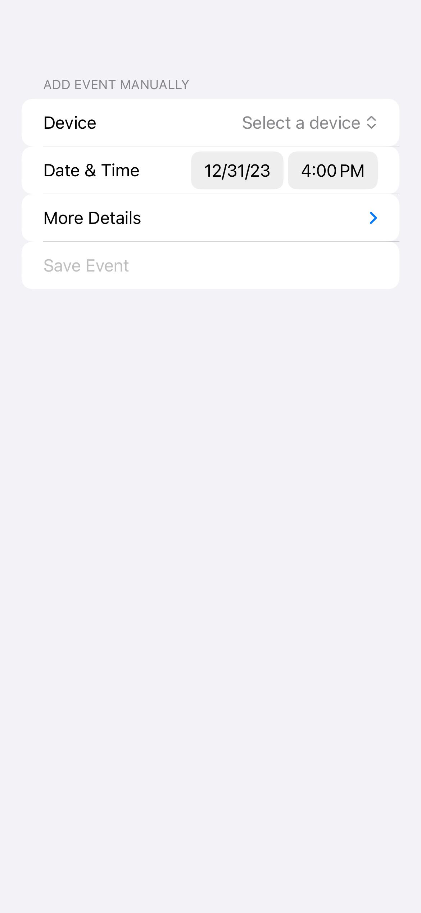

## AddDeviceScreenTests

### testAddDeviceContentView_Empty

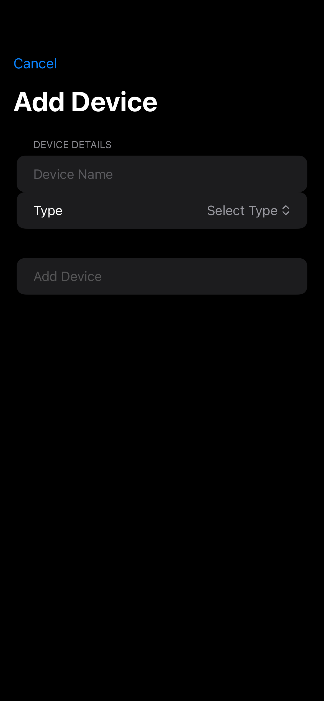

### testAddDeviceContentView_Filled

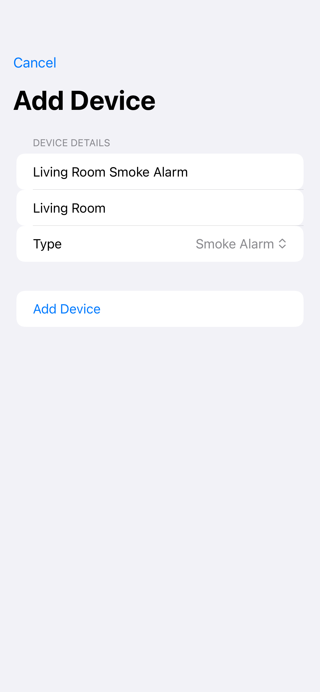

## AddDeviceTypeScreenTests

### testAddDeviceTypeContentView_Empty

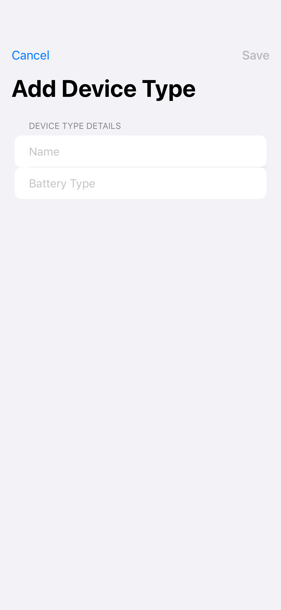

### testAddDeviceTypeContentView_Error

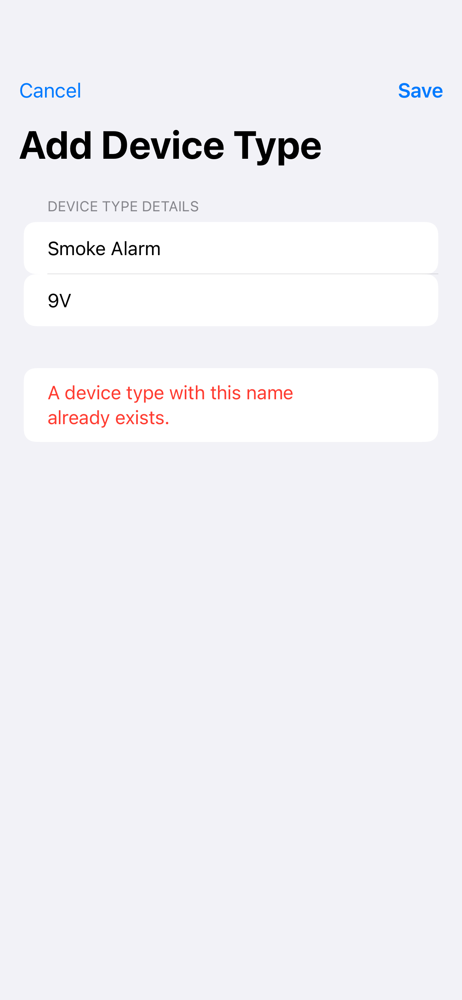

### testAddDeviceTypeContentView_Filled

## AiChatScreenTests

### testAiChatContentView_Empty

### testAiChatContentView_WithMessages

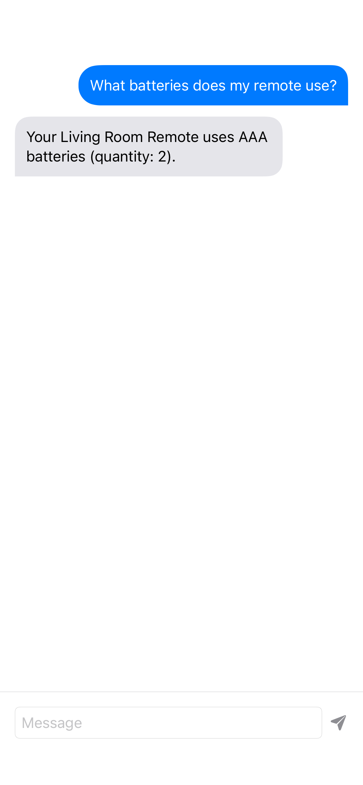

## DeviceDetailScreenTests

### testDeviceDetailContentView_Success

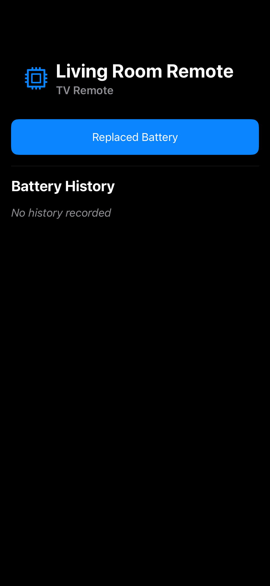

## DeviceRowTests

### testDeviceRow_NilDeviceType

### testDeviceRow_WithLocation

### testDeviceRow_WithoutLocation

## DeviceTypeListScreenTests

### testDeviceTypeListContentView_Empty

### testDeviceTypeListContentView_Loading

### testDeviceTypeListContentView_Success

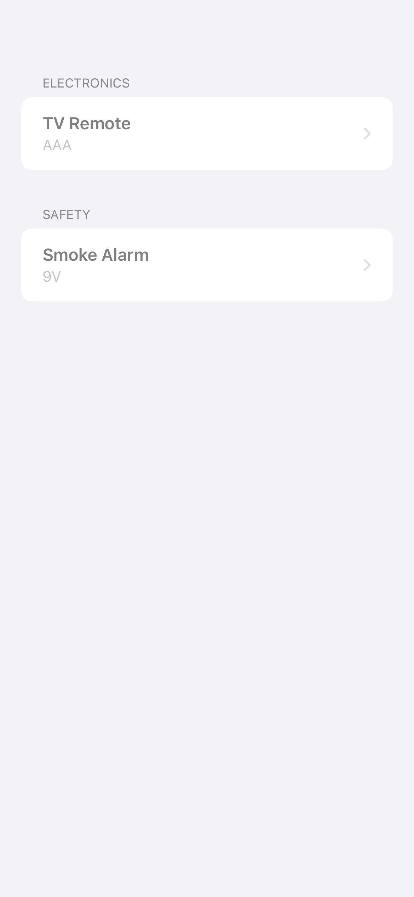

## DeviceTypeRowTests

### testDeviceTypeRow_WithBatteryType

### testDeviceTypeRow_WithoutBatteryType

## EditDeviceScreenTests

### testEditDeviceContentView_Success

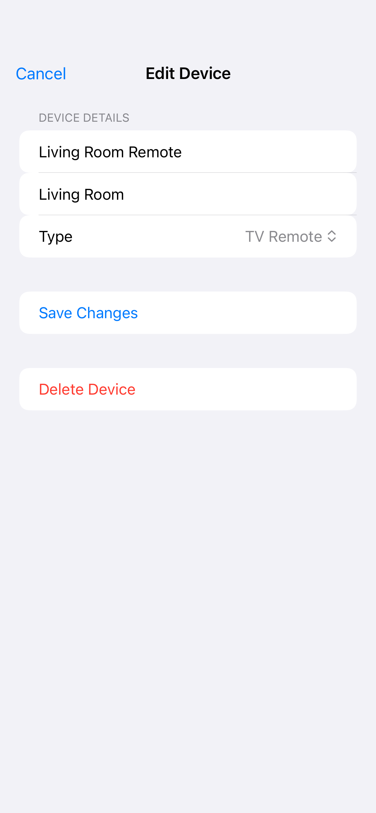

## EditDeviceTypeScreenTests

### testEditDeviceTypeContentView_Loaded

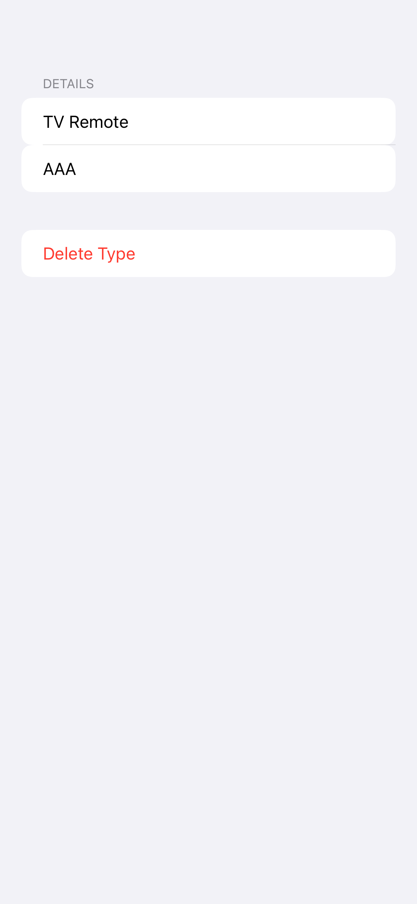

### testEditDeviceTypeContentView_Loading

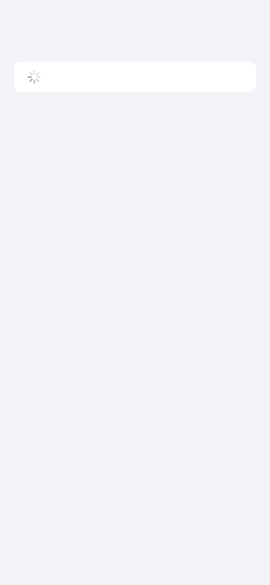

### testEditDeviceTypeContentView_NotFound

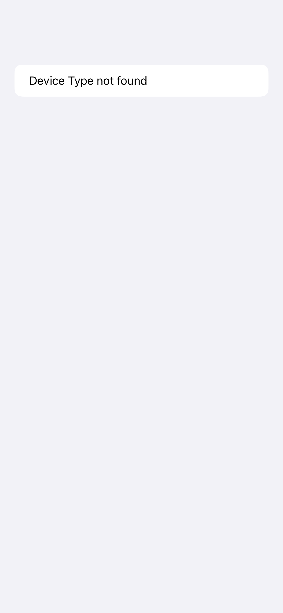

## EventDetailScreenTests

### testEventDetailContentView_Loading

### testEventDetailContentView_NotFound

### testEventDetailContentView_Success

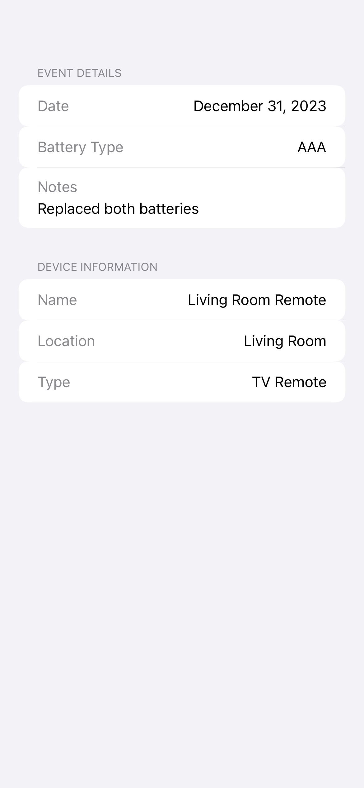

## HistoryListScreenTests

### testHistoryListContentView_Loading

### testHistoryListContentView_Success

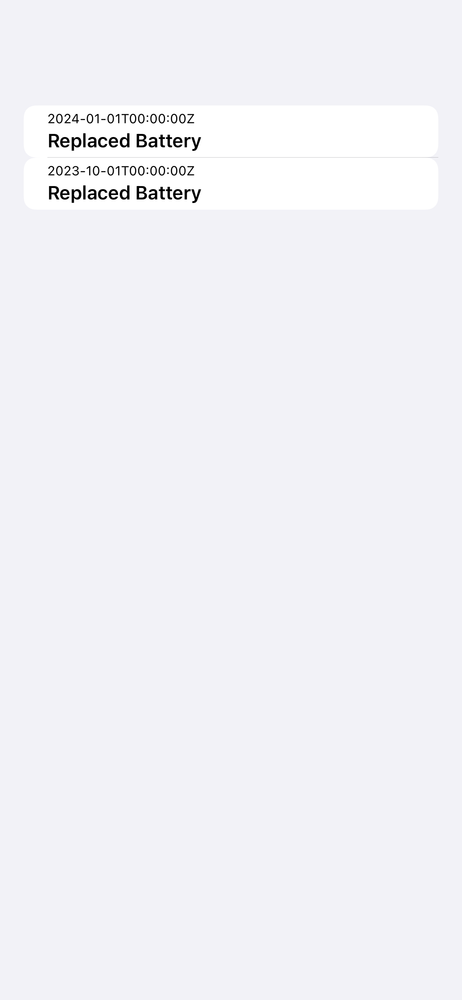

## HomeScreenTests

### testHomeContentView_Empty

### testHomeContentView_WithDevices

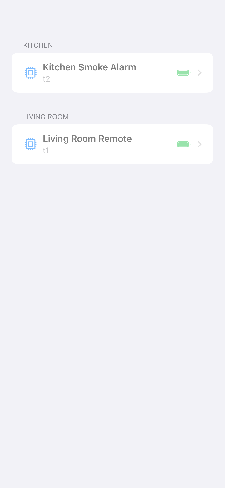

## LoginScreenTests

### testLoginContentView_Authenticating

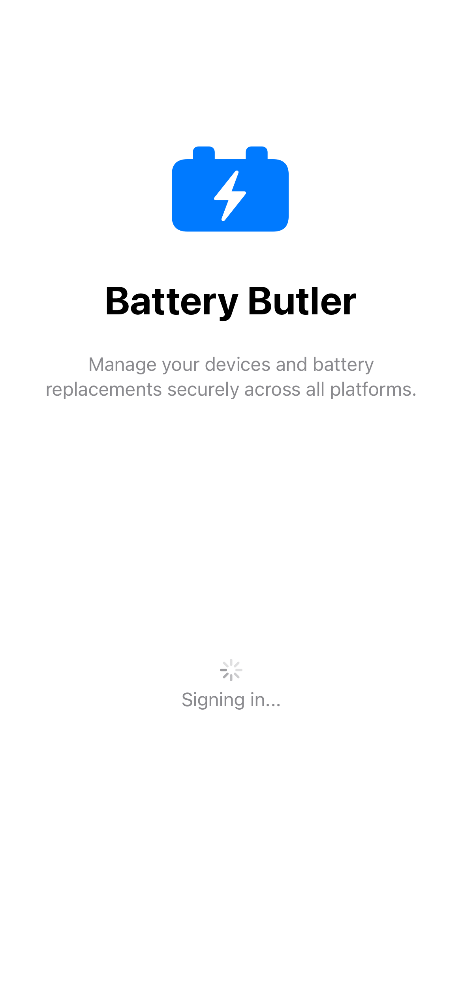

### testLoginContentView_Default

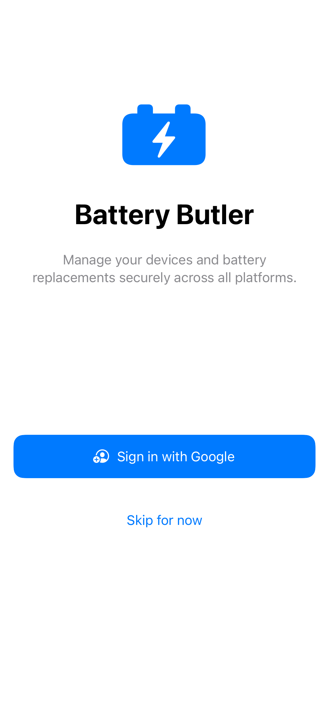

## MessageRowTests

### testMessageRow_ModelMessage

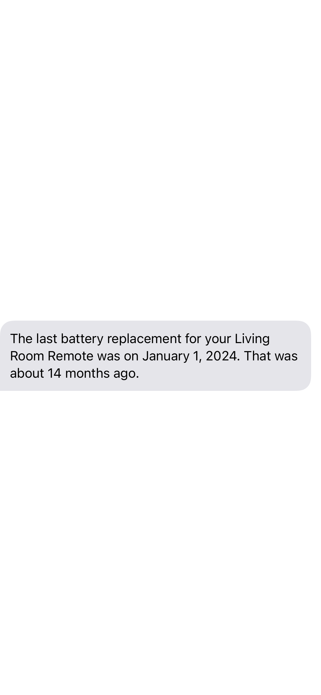

### testMessageRow_UserMessage

## SettingsScreenTests

### testSettingsContentView_Default

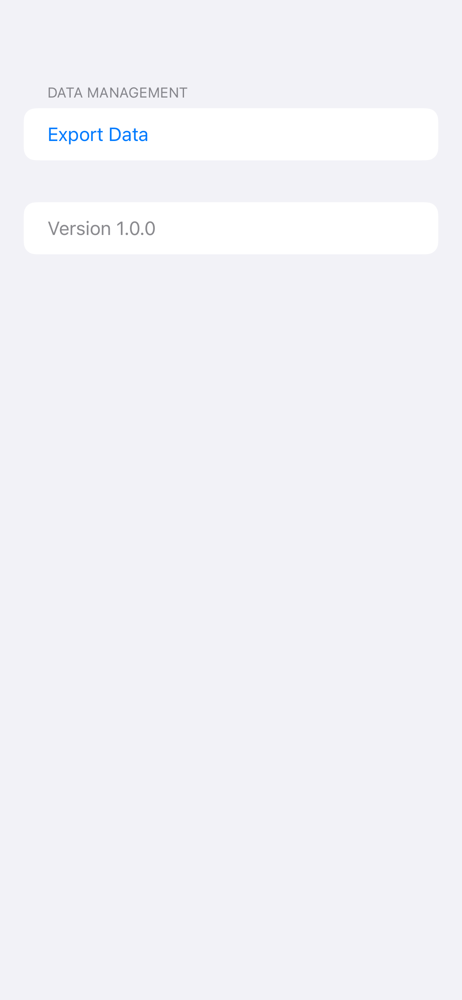

## SimpleSnapshotTests

### testSimpleView

